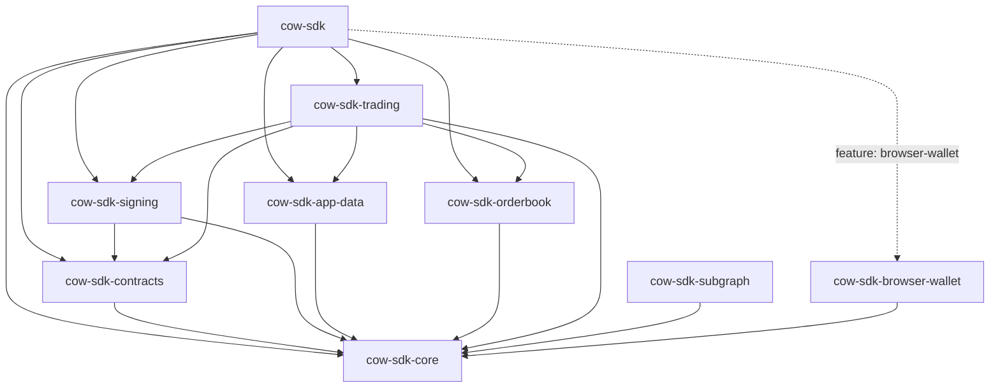

# Architecture

`cow-rs` is a small family of focused crates. The facade crate exists for
ergonomics; the leaf crates own behavior.



## Crate Roles

| Crate | Role | Use when |
| --- | --- | --- |
| `cow-sdk` | Thin public facade | You want the main Rust SDK entrypoint. |
| `cow-sdk-core` | Shared domain types, config, validation, and runtime traits | You need the common typed contracts. |
| `cow-sdk-contracts` | Deterministic contract helpers and hashing | You need ABI-level or settlement-level primitives. |
| `cow-sdk-signing` | Typed-data, signing, cancellation, and UID helpers | You need signing without the full trading layer. |
| `cow-sdk-app-data` | App-data encoding, schema handling, and CID behavior | You need app-data generation or validation. |
| `cow-sdk-orderbook` | Typed orderbook transport | You need explicit request and response control. |
| `cow-sdk-trading` | Quote-to-order workflows | You need the main trading orchestration layer. |
| `cow-sdk-subgraph` | Read-only subgraph access | You need GraphQL reads or custom subgraph queries. |
| `cow-sdk-browser-wallet` | Browser-runtime wallet integration | You need EIP-1193 wallet flows in WASM. |

## Layering

| Layer | Crates | Responsibility |
| --- | --- | --- |
| Foundation | `cow-sdk-core` | Shared domain model and runtime seams |
| Deterministic protocol transforms | `cow-sdk-contracts`, `cow-sdk-signing`, `cow-sdk-app-data` | Hashing, signing, app-data, and compatibility logic |
| Transport | `cow-sdk-orderbook`, `cow-sdk-subgraph` | Typed HTTP and GraphQL access |
| Workflow | `cow-sdk-trading` | Quote, submit, cancel, approve, and related flows |
| Runtime adapter | `cow-sdk-browser-wallet` | Browser-wallet session, signing, and chain-management support |
| Facade | `cow-sdk` | Curated public entrypoint |

## Facade And Adapter FAQ

### Why `cow-sdk-subgraph` is not part of the default facade

`cow-sdk` stays narrow on purpose. The default facade is the trading-first SDK
entrypoint, while `cow-sdk-subgraph` remains an explicit read-only analytics
crate. Keeping subgraph access separate avoids widening the default dependency
graph for consumers that only need order creation, signing, quoting, and
submission. This matches [ADR 0001](adr/0001-multi-crate-sdk-family-with-thin-facade.md)
and [ADR 0003](adr/0003-separate-read-only-subgraph-crate.md): the facade
optimizes for the main transactional path, and analytics stay opt-in.

### Provider And Signer Adapter Seams

Native runtime integrations plug in through the stable traits owned by
`cow-sdk-core`:

```rust
use cow_sdk_core::{AsyncProvider, AsyncSigner, Provider, Signer};
```

For most native integrations, implement `Provider` and `Signer` on the adapter
type that owns your RPC or signer backend. The blanket implementations then let
that same adapter satisfy the async-first surfaces through `AsyncProvider` and
`AsyncSigner` when the signer supports the async contract. Browser-wallet
support is the shipped async runtime adapter today, so `cow-sdk-browser-wallet`
implements the async side directly without widening the native facade.

The stable public contract is the trait seam itself. Native signer and RPC
integrations remain additive leaf crates so the workspace does not freeze one
provider ecosystem into `core`, `trading`, or the default `cow-sdk` facade.
Use [Integrations](integrations.md) for a worked adapter example.

## Cross-Cutting Contracts

### Runtime Traits

`cow-sdk-core` owns the signer and provider seams used across the workspace.
Sync and async contracts stay explicit, and typed-data payloads stay structured
rather than being reconstructed from ad hoc field lists. Credential-bearing
config stays explicit as input, but the default diagnostic and serialized
surfaces owned by `cow-sdk-core`, `cow-sdk-orderbook`, and `cow-sdk-app-data`
redact secret material instead of treating it as routine log data.

### Transport Ownership

Shared client policy is intentionally narrow: timeout and user-agent live in
`cow_sdk_core::HttpClientPolicy`. Retry behavior, rate limits, GraphQL request
shape, API-key handling, and pinning semantics stay with the transport crates
that own those behaviors. For subgraph access, stable production metadata and
typed request failures expose only redacted or non-secret route identity while
keeping explicit override support.

### Workflow Ownership

`cow-sdk-trading` owns quote-to-order orchestration. It composes lower-level
crates instead of spreading user-facing workflow logic across signing,
transport, and contract crates. When callers inject an orderbook client into
orderbook-bound trading helpers, that client becomes the canonical chain and
environment authority; conflicting explicit values are rejected instead of
being silently mixed through precedence fallbacks. When quote results are
reused for posting, the originating orderbook runtime binding remains part of
that contract, so quote-derived submission is rejected if the caller switches
to a different orderbook endpoint, chain, or environment. Reviewed
`sellTokenBalance` and `buyTokenBalance` semantics remain part of the same
workflow contract through quote, order, sign, and post seams. Builder-created
and directly constructed `TradingSdk` instances share the same injected-
orderbook validation boundary. Ready-state `TradingSdk` construction now
requires a stable `appCode` plus explicit or injected chain authority, while
explicit partial constructors remain available for chain-bound helper flows
such as allowance, approval, pre-sign, and on-chain cancellation. Recoverable-
signature posting rejects explicit owner or signer mismatch before submission,
and user-facing partner-fee policy remains typed on trading request surfaces
and only crosses into raw metadata at the explicit app-data translation seam.

For browser-wallet-backed trading flows, chain coherence remains leaf-owned by
`cow-sdk-browser-wallet`. When the workflow already has an explicit chain
authority, `BrowserWallet::signer_for_chain` binds that expectation to the
wallet session so quote, address, signature, gas, and transaction operations
fail fast if the active wallet chain drifts.

Typed browser-wallet chain-management follows the same rule. Successful
`switch_chain` and `switch_or_add_chain` results are returned only after the
refreshed wallet session confirms the requested chain, so switch helpers do
not treat wallet RPC acknowledgement as sufficient authority on its own.

### Browser-Runtime Support

Browser wallet support is a leaf capability, not a hidden default. The root
facade exposes it through an explicit feature, while the full browser-runtime
contract remains owned by `cow-sdk-browser-wallet`. Chain-bound browser-wallet
signers keep live wallet flows aligned with the selected workflow chain without
widening `cow-sdk-trading` into a browser-specific crate, and typed
chain-management helpers confirm refreshed session state before they report
switch success.

## Public Boundary Rules

- `cow-sdk` stays thin.
- Pure transform crates do not perform hidden network I/O.
- `cow-sdk-subgraph` remains a separate read-only crate.
- Browser-wallet method growth stays leaf-owned and typed.
- Orderbook wire DTOs remain string-heavy only at the explicit HTTP boundary.
- Public configs, endpoint discovery, and typed request failures expose only
  redacted or non-secret route identity.
- Reviewed subgraph query constants may be public when they are deliberately
  stabilized, but saved GraphQL breadth beyond that reviewed set and test-only
  schema fixtures stay non-public.

## Related Docs

- [Principles](principles.md)
- [Verification Guide](verification-guide.md)
- [Parity Matrix](parity-matrix.md)
- [ADRs](adr/README.md)
