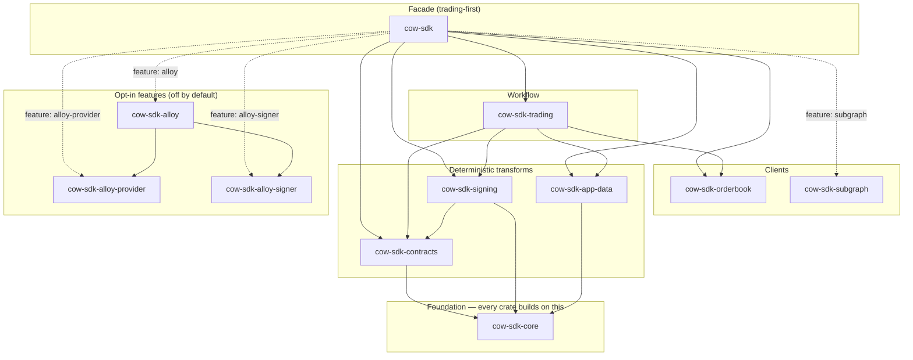
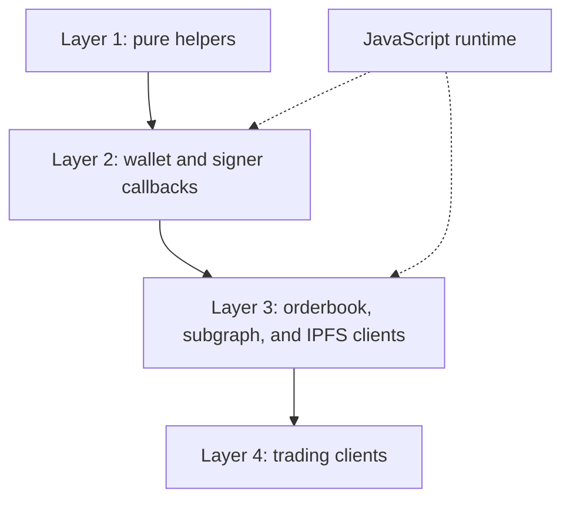

# Architecture

`cow-rs` is a small family of focused crates. The facade crate exists for
ergonomics; the leaf crates own behavior.



This diagram is an overview, not a build graph. Every crate depends on
`cow-sdk-core`, so only the transform-layer edges to the foundation are drawn,
and optional capabilities appear as dashed `feature:` edges that are off by
default. The `wasm32`-target leaf `cow-sdk-wasm` composes and serves the same
crates and is shown in
[TypeScript-Callable WASM Surface](#typescript-callable-wasm-surface); the
browser HTTP transport (`FetchTransport`) is a target-gated module of
`cow-sdk-core`, the browser sibling of the native `ReqwestTransport`. The
full inventory of consumer-facing crates is the [Crate Roles](#crate-roles)
table below (the internal, unpublished `cow-sdk-test-utils` helper crate is
omitted).

## Crate Roles

| Crate | Role | Use when |
| --- | --- | --- |
| `cow-sdk` | Thin public facade | You want the main Rust SDK entrypoint. |
| `cow-sdk-core` | Shared domain types, config, validation, runtime traits, the `HttpTransport` seam with its native `ReqwestTransport` default and the browser `FetchTransport` (the `transport::fetch` module, target-gated to `wasm32`), and the opt-in `transport::policy` module (shared HTTP retry driver `run_with_retry`, rate-limit, jitter, `Retry-After`, target-neutral wall clock, and transport classification behind the off-by-default `transport-policy` feature) | You need the common typed contracts, or consistent transport behavior across typed clients via the `transport-policy` feature. |
| `cow-sdk-contracts` | `alloy::sol!`-generated typed bindings, the typed `Registry` deployment authority, fail-closed `CoWSwapOnchainOrders` event decoding, deterministic hashing and verification helpers, the gas-free on-chain transaction builders (approve, pre-sign, settlement cancel, eth-flow create, eth-flow cancel, wrap, unwrap) returning a gas-free `UnsignedTransaction` with override-or-registry target resolution over the parity-pinned call-data encoders, plus the opt-in `cow-shed` account-abstraction module (proxy derivation, EIP-712 hook signing, calldata) | You need ABI-level, address-authority, or settlement-level primitives. |
| `cow-sdk-signing` | Typed-data, signing, cancellation, UID helpers, and the `Eip1271Cache` seam (the always-available `NoopEip1271Cache`; consumers implement the trait to memoize) | You need signing without the full trading layer. |
| `cow-sdk-app-data` | App-data encoding, schema handling, and CID behavior | You need app-data generation or validation. |
| `cow-sdk-orderbook` | Typed orderbook transport over the `HttpTransport` seam, with the `OrderbookApiBuilder` typestate | You need explicit request and response control, or the typed quote, post, and query surface without compiling the signing stack. |
| `cow-sdk-trading` | Quote-to-order workflows plus the quote, submit, cancel, and approve orchestration surface | You need the main trading orchestration layer. |
| `cow-sdk-subgraph` | Read-only subgraph access over the `HttpTransport` seam, with the `SubgraphApiBuilder` typestate | You need GraphQL reads or custom subgraph queries (via the `cow-sdk` `subgraph` feature or this crate directly). |
| `cow-sdk-wasm` | TypeScript-callable wasm-bindgen bindings over deterministic SDK helpers, typed callbacks that bridge to a host wallet, orderbook/subgraph/IPFS clients, and trading flows | JavaScript or TypeScript should call the Rust SDK through wasm exports, including browser-wallet flows driven by the host's own provider. |
| `cow-sdk-alloy-provider` | Native Alloy-backed `Provider` adapter | You need read-only chain RPC through Alloy without a signer dependency. |
| `cow-sdk-alloy-signer` | Native Alloy-backed local private-key `Signer` adapter | You need local message or EIP-712 signing without provider-backed transaction submission. |
| `cow-sdk-alloy` | Composed native Alloy provider plus signer adapter | You need one native client for `Provider`, `LogProvider`, `SigningProvider`, and `Signer` helper flows. |
| `cow-sdk-test` | Published in-memory test doubles for the public trait seams (`OrderbookClient`, `Signer`, `Provider`/`SigningProvider`), surfaced through the facade `testing` feature as `cow_sdk::testing` | You want to test your integration with no live orderbook, RPC, or wallet (a dev-dependency). |

The composable-order capability is deferred and recorded only by
[ADR 0048](adr/0048-composable-conditional-order-framework.md). No
`cow-sdk-composable` crate ships in the workspace, while the shared
deployment `Registry` already resolves composable contract addresses so the
capability can land additively without disturbing the registry authority.

Client type names follow the crate's role: the transport clients carry the `Api`
suffix (`OrderbookApi`, `SubgraphApi`) because they wrap a REST or GraphQL API,
while the high-level orchestration client is the bare domain noun `Trading`. The
name signals the altitude — a thin transport client versus the workflow client
that composes them.

## Layering

| Layer | Crates | Responsibility |
| --- | --- | --- |
| Foundation | `cow-sdk-core` | Shared domain model, runtime seams, and the `HttpTransport` trait |
| Deterministic protocol transforms | `cow-sdk-contracts`, `cow-sdk-signing`, `cow-sdk-app-data` | Typed bindings, registry authority, hashing, signing, app-data, and compatibility logic |
| Client policy | `cow-sdk-core` (`transport-policy` feature) | Shared retry, cooldown, rate-limit, and classification behavior above the raw transport seam |
| Client | `cow-sdk-orderbook`, `cow-sdk-subgraph` | Typed HTTP and GraphQL access through the `HttpTransport` seam |
| Workflow | `cow-sdk-trading` | Quote, submit, cancel, approve, and related flows |
| Runtime adapter | `cow-sdk-alloy-provider`, `cow-sdk-alloy-signer`, `cow-sdk-alloy` | Opt-in native Alloy provider/signer adapters (the browser HTTP transport ships as `cow-sdk-core`'s target-gated `transport::fetch` module) |
| TypeScript WASM leaf | `cow-sdk-wasm` | Typed wasm-bindgen exports and JavaScript callbacks over the same protocol helpers and HTTP seams |
| Facade | `cow-sdk` | Curated public entrypoint |
| Test support | `cow-sdk-test` | Published in-memory trait doubles for downstream integration tests, off the default dependency graph |

## TypeScript-Callable WASM Surface

`cow-sdk-wasm` is a peer leaf, not a replacement for the native facade and
not a replacement for the upstream `@cowprotocol/cow-sdk` TypeScript SDK.
For most browser dapps and standard TypeScript applications, the upstream
TypeScript SDK is the recommended choice because of its smaller bundle size
at equivalent feature subsets. `cow-sdk-wasm` is appropriate for specialized
cases — deterministic Rust signing parity, single-source-of-truth Rust +
TypeScript embedding, and Cloudflare Workers (size-compatible at the time of
measurement; the `trading` flavour's edge build is built and tested end-to-end in CI
(Workers Vitest), within the Workers compressed-size budget).

Its surface has four layers: pure helpers for deterministic protocol output,
wallet and signer callback exports, orderbook plus subgraph plus IPFS clients,
and trading clients. The crate reuses the same Rust helpers that native
consumers call, then crosses into JavaScript only at typed wasm-bindgen
exports and callbacks.



## Choose the crate or package by runtime

The canonical runtime-to-package routing table lives in the root README:
[When to use cow-rs](../README.md#when-to-use-cow-rs).

## TypeScript facade architecture

After publication, the npm package wraps raw wasm-bindgen output behind a
TypeScript facade. Public consumers import from the resolved package name or a
flavor subpath, while generated wasm-bindgen modules remain package-internal.

The facade exposes camelCase TypeScript APIs, named callback types, explicit
`dispose()` methods on client classes, and normalized `CowError` values. It
also adapts `transport: { kind: "fetch" }` into the callback transport ABI so
browser, Node.js, and Worker consumers can use the same public constructor
shape.

## Facade And Adapter FAQ

### Why `cow-sdk-subgraph` is opt-in rather than a default facade surface

`cow-sdk` stays narrow by default. The default facade is the trading-first SDK
entrypoint; read-only subgraph analytics are an explicit opt-in. Enable the
`subgraph` feature (`cow-sdk = { features = ["subgraph"] }`) to reach the
subgraph surface as `cow_sdk::subgraph`, or depend on the standalone
`cow-sdk-subgraph` crate directly. The feature is off by default, so consumers
that only need order creation, signing, quoting, and submission pay no subgraph
dependency. This matches [ADR 0001](adr/0001-multi-crate-sdk-family-with-thin-facade.md)
and [ADR 0003](adr/0003-separate-read-only-subgraph-crate.md): the facade
optimizes for the main transactional path, and analytics stay opt-in.

### Provider And Signer Adapter Seams

Native runtime integrations plug in through the stable traits owned by
`cow-sdk-core`:

```rust
use cow_sdk_core::{Provider, Signer, SigningProvider};
```

The same seam also owns the transaction lifecycle boundary. Signers return
`TransactionBroadcast`, a hash-only broadcast acknowledgement, while provider
receipt lookups return `TransactionReceipt` with optional mined-state fields
such as status, block, gas, sender, and recipient. Adapter implementations must
not turn submission into implicit receipt polling; mined observation stays an
explicit provider call.

The SDK declares its provider, signer, and signing-provider contracts in
`cow-sdk-core` rather than binding trading helpers directly to a concrete
Ethereum runtime library. This lets one trading call site drive native Alloy on
x86 / ARM, a host-supplied EIP-1193 wallet on `wasm32` (wrapped into the
`cow-sdk-wasm` typed wallet callbacks), or any custom adapter that
implements the same traits. If `cow-sdk-trading` depended on a concrete
provider library directly, the wasm path would have to pull native-only
dependencies or fork trading helpers per runtime.

For custom integrations, implement `Provider` for the RPC backend and `Signer`
for the signer backend; the narrower [`TypedDataSigner`] and
[`DigestSigner`] capability traits per
[ADR 0045](adr/0045-async-signer-trait-narrowing.md) remain available for
callback-shaped adapters that expose only one signing operation, and
`Signer::address` serves owner resolution.
Wallet-capable adapters implement `SigningProvider`, which extends `Provider`
with signer creation. Adapters that can fetch event logs additionally implement
`LogProvider`, the opt-in log-fetch capability supertrait
([ADR 0057](adr/0057-log-provider-capability-trait.md)); its `get_logs` performs
a single bounded query — over an address set and the four EVM topic slots, so
indexed arguments such as an event's `owner` filter server-side — that feeds the
fail-closed event decoders.
Native Alloy support is already shipped as
`cow-sdk-alloy-provider`, `cow-sdk-alloy-signer`, and `cow-sdk-alloy`.
For JavaScript and TypeScript consumers, the `cow-sdk-wasm` package exposes the
same trait surface as typed callbacks — including the typed-data signer callback
([ADR 0040](adr/0040-wallet-provider-callback-boundary-for-js-consumers.md)) — so
the host application's own wallet stack (viem, wagmi, or any EIP-1193 provider)
supplies the wallet connection without widening the native facade.

The native Alloy adapter family ships as three crates so a consumer can pull
only the capabilities they exercise: `cow-sdk-alloy-provider` for read-only
RPC, `cow-sdk-alloy-signer` for local private-key signing, and `cow-sdk-alloy`
for the composed read, log-fetch, and sign flow that most trading applications
need. The composed client implements `LogProvider` over the same provider it
already holds, so a consumer fetches event logs without a second provider. The
split keeps the provider leaf free of the local private-key signer
(`alloy-signer-local`) and the order-signing surface (`alloy-sol-types`,
`cow-sdk-contracts`) — the read path links no private-key signing machinery,
though it shares alloy's k256 recovery primitive — and lets the signer leaf
stay free of transport plumbing.

The stable public contract is the trait seam itself. Native signer and RPC
integrations remain additive leaf crates so the workspace does not freeze one
provider ecosystem into `core`, `trading`, or the default `cow-sdk` facade.
Use [Integrations](integrations.md) for a worked adapter example.

## Cross-Cutting Contracts

### Primitive Layer

`alloy_primitives` is the canonical EVM primitive layer and `alloy_sol_types`
is the canonical EIP-712 / Solidity-binding layer across the workspace per
[ADR 0052](adr/0052-alloy-primitives-canonical-primitive-layer.md). The
cow-named identity and numeric public types are cow-owned
`#[repr(transparent)]` newtypes around the corresponding `alloy_primitives`
type; `TypedDataDomain` is a cow-owned `#[non_exhaustive]` struct that emits
the canonical EIP-1193 wire shape through its own `Serialize` impl and
bridges to `alloy_sol_types::Eip712Domain` via an `to_alloy_domain()`
adapter at the EIP-712 hashing seam.

### Runtime Traits

`cow-sdk-core` owns the signer and provider seams used across the workspace.
The trait surface is async by construction, and typed-data payloads stay
structured rather than being reconstructed from ad hoc field lists.
Credential-bearing
config stays explicit as input, but the default diagnostic and serialized
surfaces owned by `cow-sdk-core`, `cow-sdk-orderbook`, and `cow-sdk-app-data`
redact secret material instead of treating it as routine log data.
Transaction broadcast and receipt observation stay separate typed results so
callers can reason about submission, inclusion, and execution without
provider-specific timing assumptions.

### Typed Amounts

`cow-sdk-core` keeps the atomic amount role at the typed boundary.
`Amount` is a cow-owned `#[repr(transparent)]` newtype
over `alloy_primitives::U256` per
[ADR 0052](adr/0052-alloy-primitives-canonical-primitive-layer.md),
preserving the decimal-string wire form. `Amount` carries the atomic
(base-unit) quantity that crosses the wire; human-readable token amounts
convert in and out through `Amount::from_units(whole, decimals)` for whole
amounts, `Amount::parse_units(value, decimals)` for fractional or textual
input, and `Amount::format_units(decimals)`, which scale by `10^decimals`
with integer arithmetic (never floating point) so the round trip stays exact. `Amount` exposes a fallible-by-return arithmetic surface — `checked_*` (returning
`Option`) and explicit `saturating_*` clamps — and intentionally ship no
bare `Add` / `Sub` / `Mul` operators, so an overflow or underflow can
never silently wrap (or panic) on a typed amount; a caller that needs raw
wrapping reaches through `as_u256` / `into_u256`.
The cow-owned `Deserialize` impl is strict-decimal-only on the wire
boundary; the cow `Amount::new` constructor stays
lenient to preserve the existing constructor contract.

### Transport Seams

`cow-sdk` exposes two orthogonal runtime seams that never share a concrete
backend. The `HttpTransport` trait in `cow-sdk-core` is the HTTPS seam used
by `cow-sdk-orderbook` and `cow-sdk-subgraph` for REST and GraphQL
dispatch; native consumers get `ReqwestTransport` from `cow-sdk-core`, and
browser consumers get `FetchTransport` from `cow-sdk-core`'s `transport::fetch`
module, the target-gated browser sibling of `ReqwestTransport`. The shared
retry driver
(`run_with_retry`) plus retry, cooldown, rate-limit, target-neutral wall
clock, and transport-error classification policy lives in the opt-in
`cow_sdk_core::transport::policy` module (the off-by-default `transport-policy`
feature), so the orderbook, subgraph, and IPFS clients run every attempt
through one retry loop and keep the same behavior on native and browser
targets without widening the raw `HttpTransport` trait. The `Provider` trait (also in `cow-sdk-core`)
is the read-only chain-RPC seam used by on-chain helpers such as allowance
reads, EIP-1271 verification, and on-chain cancellation. Signer creation for
wallet-capable providers lives in `SigningProvider`; no provider implementation
ships by default, so consumers bring their own through the
[Providers](providers/README.md) adapter guide.

The trait is dyn-compatible, so injected clients compose transports behind
`Arc<dyn HttpTransport + Send + Sync>`. Typed failures flow through a single
`TransportError` enum and its `TransportErrorClass` partition, both of
which strip URLs before wrapping so credential-bearing query strings never
surface through `Debug` or `Display`. The full transport story lives in
[Transport](transport.md).

### Transport Ownership

Retry behavior, rate limits, GraphQL request shape, and API-key handling
stay with the transport crates that own those behaviors.
For subgraph access, stable production metadata and typed request failures
expose only redacted or non-secret route identity while keeping explicit
override support.

Production deployments that issue requests across several chains can pool
a single `reqwest::Client` across every orderbook and subgraph instance
they build. On native targets, `OrderbookApi::builder()` and
`SubgraphApi::builder()` both expose a `.client(shared_client)` convenience
method over `ReqwestTransport` that preserves any custom keep-alive,
timeout, or TLS settings verbatim, so one warm connection cache backs
every chain the consumer routes through. Browser consumers install
`FetchTransport` through the builder's `.transport(...)` setter instead.
The [Performance](performance.md) page records the recommended HTTP/2
keep-alive recipe, shared-client usage pattern, and the knob summary that
accompanies each opt-in setting.

### Cancellation

Long-running public operations on `OrderbookApi`, `SubgraphApi`, and
`Trading` each expose one canonical async method, and callers compose
cooperative cancellation by wrapping the returned future through
`cow_sdk_core::Cancellable::cancel_with(&token)` at the call site. The
`cow_sdk_core::CancellationToken` is a re-export of
`tokio_util::sync::CancellationToken`, so every SDK surface routes
cancellation through the same typed import. The combinator polls the
borrowed token in a biased branch before each inner poll; when the token
fires, the wrapper drops the inner request future so the underlying
socket releases promptly, and the typed `Cancelled` variant on the
relevant error aggregate surfaces at the caller.

For example, the following quotes and posts a swap with a shared
cancellation token:

```rust,ignore
use cow_sdk_core::Cancellable;

let token = cow_sdk_core::CancellationToken::new();
let result = trading
    .post_swap_order(params, &signer, None)
    .cancel_with(&token)
    .await?;
```

Cancellation is cooperative: the caller owns the token, and every SDK
instance that needs to propagate shutdown through a shared token simply
clones it. `From<Cancelled>` bridges on `CoreError`, `OrderbookError`,
`SubgraphError`, `TradingError`, `SigningError`, the
native Alloy adapter errors, and the facade `CowError` lift the marker through
`?` across every public error boundary.

### Workflow Ownership

`cow-sdk-trading` owns quote-to-order orchestration. It composes lower-level
crates instead of spreading user-facing workflow logic across signing,
transport, and contract crates.

It offers each operation at complementary layers: a stateless free function, a
method on the bound `Trading` client that resolves stored chain, app-code, and
orderbook context before delegating to that free function, and the fluent
`Trading::swap()` and `Trading::limit()` builders for the order-placement
operations (whose positional constructors carry transposable token and amount
pairs the named setters make non-transposable). Each higher layer is a thin
delegation to the one below, so there is one implementation per operation. The
fluent order-lifecycle builders live here rather than on the orderbook client:
placing an order signs, generates app-data, and resolves eth-flow contracts, so it
belongs in the crate that already depends on signing, app-data, and contracts.
`cow-sdk-orderbook` and `cow-sdk-subgraph` stay signing-free typed transport
clients, so a consumer can use the typed transport without compiling the signing
stack ([ADR 0069](adr/0069-layered-trading-operation-surface-and-signing-free-transport.md)).

When callers inject an orderbook client into
orderbook-bound trading helpers, that client becomes the canonical chain and
environment authority; conflicting explicit values are rejected instead of
being silently mixed through precedence fallbacks. When quote results are
reused for posting, the originating orderbook runtime binding remains part of
that contract, so quote-derived submission is rejected if the caller switches
to a different orderbook endpoint, chain, or environment. Reviewed
`sellTokenBalance` and `buyTokenBalance` semantics remain part of the same
workflow contract through quote, order, sign, and post seams. The typestate
builder and its total-input shortcuts share the same injected-orderbook
validation boundary. Ready-state `Trading` construction requires a validated
`AppCode` plus explicit or injected chain authority; chain-bound helpers that
need no app code — allowance, approval, pre-sign, and on-chain cancellation —
are the crate's free functions. Recoverable-signature posting
rejects explicit owner or signer mismatch before submission, and user-facing
partner-fee policy remains typed on trading request surfaces and only crosses
into raw metadata at the explicit app-data translation seam. The same
chain-coherence guarantees hold regardless of which `Signer` and `Provider`
back the workflow.

### Browser-Runtime Support

Browser and wallet integration is served to JavaScript and TypeScript consumers
by the `cow-sdk-wasm` package together with the host application's own wallet
stack (viem, wagmi, or any EIP-1193 provider). The SDK exposes the typed
callback boundary
([ADR 0040](adr/0040-wallet-provider-callback-boundary-for-js-consumers.md)) and
the TypeScript-callable wasm surface
([ADR 0039](adr/0039-typescript-callable-wasm-sdk-surface.md)); the host supplies
the wallet connection. The native facade stays free of any browser-specific
crate, and chain coherence is enforced at the workflow level through the same
`Signer`/`Provider` seams that native consumers use.

## Public Boundary Rules

- `cow-sdk` stays thin.
- Pure transform crates do not perform hidden network I/O.
- The fluent order-lifecycle (swap) builder lives in `cow-sdk-trading`;
  `cow-sdk-orderbook` and `cow-sdk-subgraph` depend on no signing crate and host
  no order-lifecycle builder, so the typed transport stays usable without the
  signing stack.
- `cow-sdk-subgraph` stays a separate read-only crate, re-exported through
  `cow-sdk` only behind the off-by-default `subgraph` feature.
- Wallet integration crosses into the host through the typed wallet callbacks
  in `cow-sdk-wasm`; the SDK owns the callback shape, not the wallet
  connection.
- Orderbook wire DTOs remain string-heavy only at the explicit HTTP boundary.
- Public configs, endpoint discovery, and typed request failures expose only
  redacted or non-secret route identity.
- Reviewed subgraph query constants may be public when they are deliberately
  stabilized, but saved GraphQL breadth beyond that reviewed set and test-only
  schema fixtures stay non-public.
- `OrderbookApi`, `SubgraphApi`, and `Trading` construct exclusively
  through their typestate builders; no free-function public constructors
  remain on any of the three.
- Native Alloy dependencies are confined to the reviewed opt-in adapter crates:
  `alloy-provider` is allowed only in `cow-sdk-alloy-provider` and
  `cow-sdk-alloy`, while `alloy-signer-local` is allowed only in
  `cow-sdk-alloy-signer` and `cow-sdk-alloy`. The default facade stays
  provider-neutral unless an Alloy feature is enabled.
- Every deployed-contract-address lookup routes through the typed
  `Registry` authority; hard-coded chain-scoped address constants are not
  allowed in shipped crates.
- Every ABI binding the SDK emits call-data against is declared inline with
  `alloy::sol!` and proven byte-for-byte against the upstream protocol by the
  TypeScript-SDK-derived call-data, EIP-712, and selector fixtures under
  `parity/fixtures/`; the upstream Solidity each binding mirrors is pinned by
  commit in `parity/source-lock.yaml`.
- On-chain order event logs (`CoWSwapOnchainOrders` `OrderPlacement` /
  `OrderInvalidation`) are decoded through a fail-closed, provider-free decoder
  that validates every field and never panics on adversarial input.

## Related Docs

- [Principles](principles.md)
- [Transport](transport.md)
- [Deployments](deployments.md)
- [Verification Guide](verification.md)
- [Parity Matrix](parity.md)
- [ADRs](adr/README.md)
