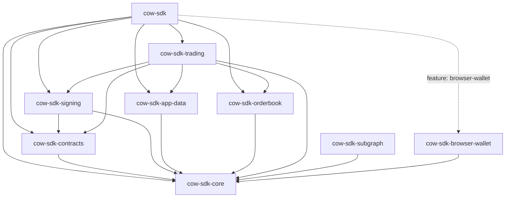

# Architecture

`cow-rs` is organized as a small family of focused crates. The root crate exists for ergonomics; the leaf crates own behavior.

## Layers

| Layer | Crates | Responsibility |
| --- | --- | --- |
| Foundation | `cow-sdk-core` | Shared domain types, chain/env config, validation, active signer/provider contracts, and deferred transport adapter contracts |
| Protocol primitives | `cow-sdk-contracts`, `cow-sdk-signing`, `cow-sdk-app-data` | Deterministic transforms for hashes, signatures, order ids, metadata, and CID behavior |
| Transport | `cow-sdk-orderbook`, `cow-sdk-subgraph` | Typed HTTP and GraphQL access with explicit error boundaries |
| Workflow | `cow-sdk-trading` | Quote-to-order, submission, cancellation, allowance, approval, and slippage flows |
| Runtime adapter | `cow-sdk-browser-wallet` | Async EIP-1193 integration for browser wallets |
| Facade | `cow-sdk` | Thin re-export layer for the primary public surface |

## Runtime Traits

`cow-sdk-core` exposes signer and provider traits that are used by signing, contracts, trading, and browser-wallet flows:

- `Signer` and `Provider` cover sync native/test integration seams.
- `AsyncSigner` and `AsyncProvider` cover async and browser-wallet paths, with blanket implementations for compatible sync types.

The `HttpTransport`, `GraphTransport`, and `PinningTransport` traits are extension adapter contracts. The orderbook, subgraph, and app-data crates currently own their typed request behavior directly because those surfaces have API-specific retry, header, credential, and decoding rules.

## DTO Boundaries

Order-like structures are kept separate when they represent different protocol boundaries:

| Type | Boundary |
| --- | --- |
| `cow_sdk_core::UnsignedOrder` | User-domain signing and trading input |
| `cow_sdk_core::Order` | Optional user-domain envelope with owner or uid context |
| `cow_sdk_contracts::Order` | Contract ABI and EIP-712 payload before normalization |
| `cow_sdk_contracts::NormalizedOrder` | Canonical contract hashing payload after defaults and validation |
| `cow_sdk_orderbook::QuoteData` | Quote response wire DTO |
| `cow_sdk_orderbook::OrderCreation` | Order submission wire DTO |
| `cow_sdk_orderbook::Order` | Orderbook order response DTO with persisted API state |

The conversion from `UnsignedOrder` to the contract ABI order is explicit. Quote-to-submission conversion remains in the orderbook crate because it adds signature, signer, signing-scheme, and quote-id fields required by the orderbook API.

## Design Rules

- `cow-sdk` adds no hidden business logic.
- `cow-sdk-trading` owns user-facing orchestration.
- `cow-sdk-subgraph` stays read-only and separate from the trading facade.
- Browser wallet support is feature-gated and async.
- Pure transform crates do not perform network I/O.

## Why This Shape

This layout keeps low-level protocol semantics stable, gives higher-level consumers a clean trading entrypoint, and avoids coupling browser-only behavior to native server and bot use cases. Generated or schema-derived evidence should remain internal or test-only unless a later review explicitly promotes it into public SDK API.

For a review-oriented walkthrough, see [Review Guide](review-guide.md).
