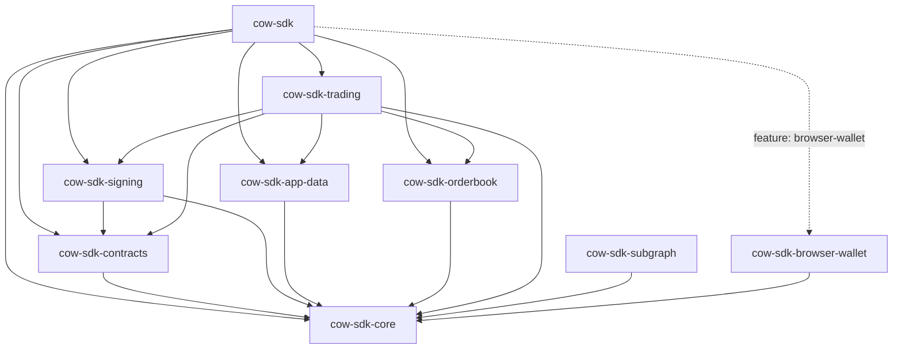

# Architecture

`cow-rs` is organized as a small family of focused crates. The root crate exists for ergonomics; the leaf crates own behavior.

## Layers

| Layer | Crates | Responsibility |
| --- | --- | --- |
| Foundation | `cow-sdk-core` | Shared domain types, chain/env config, validation, active signer/provider contracts, and deferred transport adapter contracts |
| Protocol primitives | `cow-sdk-contracts`, `cow-sdk-signing`, `cow-sdk-app-data` | Deterministic transforms for hashes, signatures, order ids, smart-account verification, metadata, and CID behavior |
| Transport | `cow-sdk-orderbook`, `cow-sdk-subgraph` | Typed HTTP and GraphQL access with explicit error boundaries |
| Workflow | `cow-sdk-trading` | Quote-to-order, submission, cancellation, allowance, approval, and slippage flows |
| Runtime adapter | `cow-sdk-browser-wallet` | Async EIP-1193 integration and typed browser-wallet methods for supported wallet-specific behavior |
| Facade | `cow-sdk` | Thin re-export layer for the primary public surface |

## Runtime Traits

`cow-sdk-core` exposes signer and provider traits that are used by signing, contracts, trading, and browser-wallet flows:

- `Signer` and `Provider` cover sync native/test integration seams.
- `AsyncSigner` and `AsyncProvider` cover async and browser-wallet paths, with blanket implementations for compatible sync types.
- `TypedDataPayload` carries the explicit EIP-712 signer contract: domain, primary type, full type map, and canonical message JSON. Order-facing helpers in `cow-sdk-signing` are typed convenience wrappers over that lower-level payload.
- `cow-sdk-signing` owns explicit CoW order and order-cancellation payload construction. `cow-sdk-browser-wallet` transports those payloads to the provider and keeps the older field-list signing seam as a bounded compatibility path for the same CoW shapes only.

The `HttpTransport`, `GraphTransport`, and `PinningTransport` traits are extension adapter contracts. The orderbook, subgraph, and app-data crates own their typed request behavior directly because those surfaces have API-specific retry, header, credential, and decoding rules.

Smart-account signature verification follows the same boundary rule:

- `cow-sdk-contracts` owns the low-level EIP-1271 verification seam over explicit `Provider` and `AsyncProvider` inputs.
- `cow-sdk-signing` re-exports that seam for signing-adjacent consumers.
- `cow-sdk-trading` adds an order-level wrapper that computes the order digest and then calls the explicit verification helper.
- Verification is opt-in. Posting flows do not silently require providers when callers only need payload generation or submission.

## Transport Policy

Shared transport client settings live in `cow_sdk_core::HttpClientPolicy`. That type covers only settings that mean the same thing across crates:

- request timeout
- user-agent

Crate-local transport behavior is crate-local:

| Crate | Shared policy input | Crate-local transport policy |
| --- | --- | --- |
| `cow-sdk-orderbook` | `HttpClientPolicy` | `OrderBookTransportPolicy` adds retry and rate-limit behavior. Chain/env base URL selection lives in `ApiContext`, and env-specific overrides are explicit builders on `OrderBookApi`. Each `OrderBookApi` instance owns its own request client and async-safe shared limiter state, and clones of that instance share the same limiter budget. |
| `cow-sdk-subgraph` | `HttpClientPolicy` | `SubgraphTransportPolicy` keeps client settings explicit while `SubgraphConfig` owns chain selection, API-key-derived production URLs, and caller overrides. `SubgraphQueryRequest` is the generic GraphQL request contract and carries the document, optional variables, and optional operation name explicitly. `SubgraphError` distinguishes transport, HTTP status, GraphQL payload, serialization, missing-data, unsupported-network, and empty-totals cases. Canonical operations are backed by private saved GraphQL documents, and schema/codegen evidence stays in test-only schema fixtures. |
| `cow-sdk-app-data` | none for the fetch adapter trait itself | `IpfsFetchPolicy` owns read-base-URI selection only. Pinning credentials and write endpoints live in `IpfsConfig` and upload helpers. |

This split keeps shared client behavior explicit without hiding API-specific semantics behind a false common abstraction.

For orderbook request execution specifically:

- rate-limit waiting happens before each request attempt
- retry backoff happens only after retryable API responses or transport failures
- cancelling a waiting orderbook request releases no shared lock and leaves the limiter reusable for later calls

## Trading SDK Configuration

`TradingSdk` uses instance-scoped builder and options composition.

- `TradingSdk::builder()` configures trader defaults and optional injected orderbook clients.
- Injected orderbook clients are authoritative for orderbook-bound chain and env selection. Conflicting defaults or call-level requests fail explicitly.
- Advanced quote and post settings override overlapping call-level trade fields such as owner, receiver, validity, slippage metadata, partner-fee metadata, and partial-fill flags.
- Call-level params override SDK defaults for owner, env, settlement overrides, and EthFlow overrides.
- Signer address resolution is an owner fallback only when no advanced override, call-level value, or SDK default provides one.

## DTO Boundaries

Order-like structures are kept separate when they represent different protocol boundaries:

| Type | Boundary |
| --- | --- |
| `cow_sdk_core::UnsignedOrder` | User-domain signing and trading input |
| `cow_sdk_core::Order` | Optional user-domain envelope with owner or uid context |
| `cow_sdk_contracts::Order` | Contract ABI and EIP-712 payload before normalization |
| `cow_sdk_contracts::NormalizedOrder` | Canonical contract hashing payload after defaults and validation |
| `cow_sdk_orderbook::QuoteData` | Quote response wire DTO |
| `cow_sdk_orderbook::OrderCreation` | Order submission wire DTO |
| `cow_sdk_orderbook::Order` | Orderbook order response DTO with persisted API state |

The conversion from `UnsignedOrder` to the contract ABI order is explicit. Quote-to-submission conversion lives in the orderbook crate because it adds signature, signer, signing-scheme, and quote-id fields required by the orderbook API.

## Typed Public Boundary

Public Rust entry points default to validated domain wrappers instead of ad hoc strings whenever `cow-rs` owns the contract:

| Meaning | Default public type | String-heavy forms allowed only at |
| --- | --- | --- |
| Address | `cow_sdk_core::Address` | Serialized JSON and explicit wire DTOs |
| App-data hash | `cow_sdk_core::AppDataHash` | Serialized JSON and explicit wire DTOs |
| 32-byte hash, order digest, tx hash, block hash | `cow_sdk_core::Hash32` aliases | Serialized JSON and explicit wire DTOs |
| Amount, value, gas, execution quantity | `cow_sdk_core::Amount` | Explicit wire DTOs and named compatibility payloads |
| Signed deltas | `cow_sdk_core::SignedAmount` | Explicit wire DTOs and simulation payloads |
| Call data and raw byte payloads | `cow_sdk_core::HexData` | Explicit ABI/wire encoding boundaries |

That rule is applied in `cow-sdk-core`, `cow-sdk-contracts`, `cow-sdk-signing`, `cow-sdk-trading`, and `cow-sdk-browser-wallet`.

The main exception is `cow-sdk-orderbook`, which keeps orderbook HTTP DTOs string-heavy where the upstream API is string-heavy. That is an explicit transport boundary, not the recommended user-domain contract for Rust consumers.

## Design Rules

- `cow-sdk` adds no hidden business logic.
- `cow-sdk-trading` owns user-facing orchestration.
- `cow-sdk-subgraph` is read-only and separate from the trading facade.
- `cow-sdk-subgraph` generic queries use an explicit `SubgraphQueryRequest` contract instead of inferred operation metadata.
- Browser wallet support is feature-gated and async.
- Browser-wallet-specific method growth stays leaf-owned and typed. Chain management and similar wallet namespace helpers do not expand into a generic raw wallet-RPC passthrough.
- The root facade remains narrower than `cow-sdk-browser-wallet`. Feature-gated re-export does not make every leaf-owned wallet method part of the default SDK identity.
- Pure transform crates do not perform network I/O.

## Browser Wallet Support Contract

Browser wallet support is a supported browser-runtime surface with explicit boundaries:

- Deterministic proof mode lives in the mock wallet and crate-level contract tests. That path is the automated proof for request shape, typed session updates, typed-data transport, chain management, and trading integration.
- Injected-provider mode is the supported live browser path. It uses explicit EIP-1193 methods, bounded wallet discovery, typed session state, and typed chain-management helpers on supported chains.
- The leaf crate binds stable EIP-1193 entry points such as `request`, `on`, and `removeListener` through private typed imports. Direct Promise awaiting happens only after the provider method has already returned a Promise, while dynamic reflection stays limited to discovery payloads, compatibility probes, vendor metadata, and provider-specific error objects.
- Broader extension behavior remains environment-sensitive. Wallet authorization UX, extension availability, chain inventory, discovery timing, and vendor-specific method support are controlled by the injected provider and browser runtime.

The root `cow-sdk` crate keeps browser-wallet support behind the `browser-wallet` feature for ergonomic re-export only. The full browser-runtime contract remains leaf-owned in `cow-sdk-browser-wallet`.

## Why This Shape

This layout keeps low-level protocol semantics stable, gives higher-level consumers a clean trading entrypoint, and avoids coupling browser-only behavior to native server and bot use cases. Generated or schema-derived artifacts belong in non-public or test-only locations rather than the supported public SDK API.

For package boundaries and validation guidance, see [Verification Guide](verification-guide.md).
