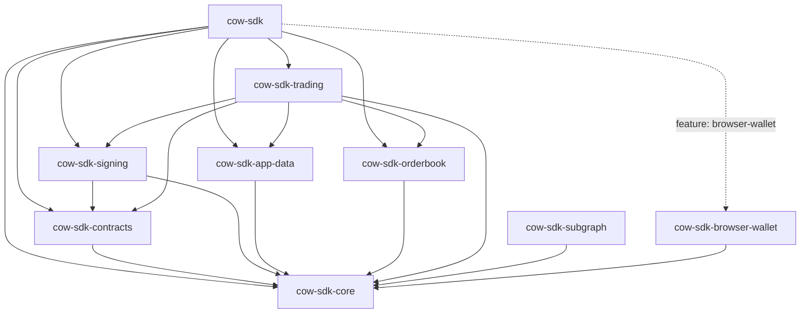

# Architecture

`cow-rs` is organized as a small family of focused crates. The root crate exists for ergonomics; the leaf crates own behavior.

## Layers

| Layer | Crates | Responsibility |
| --- | --- | --- |
| Foundation | `cow-sdk-core` | Shared domain types, chain/env config, validation, sync and async runtime contracts |
| Protocol primitives | `cow-sdk-contracts`, `cow-sdk-signing`, `cow-sdk-app-data` | Deterministic transforms for hashes, signatures, order ids, metadata, and CID behavior |
| Transport | `cow-sdk-orderbook`, `cow-sdk-subgraph` | Typed HTTP and GraphQL access with explicit error boundaries |
| Workflow | `cow-sdk-trading` | Quote-to-order, submission, cancellation, allowance, approval, and slippage flows |
| Runtime adapter | `cow-sdk-browser-wallet` | Async EIP-1193 integration for browser wallets |
| Facade | `cow-sdk` | Thin re-export layer for the primary public surface |

## Design Rules

- `cow-sdk` adds no hidden business logic.
- `cow-sdk-trading` owns user-facing orchestration.
- `cow-sdk-subgraph` stays read-only and separate from the trading facade.
- Browser wallet support is feature-gated and async.
- Pure transform crates do not perform network I/O.

## Why This Shape

This layout keeps low-level protocol semantics stable, gives higher-level consumers a clean trading entrypoint, and avoids coupling browser-only behavior to native server and bot use cases.
