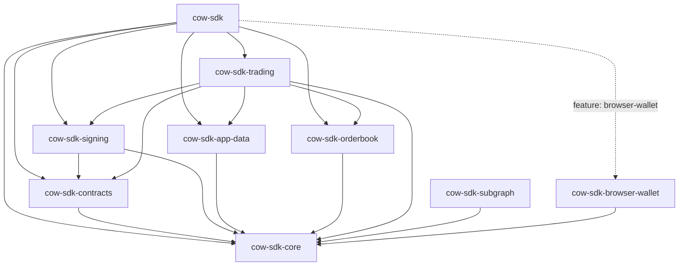

# Architecture

`cow-rs` is a small family of focused crates. The facade crate exists for
ergonomics; the leaf crates own behavior.

## Crate Roles

| Crate | Role | Use when |
| --- | --- | --- |
| `cow-sdk` | Thin public facade | You want the main Rust SDK entrypoint. |
| `cow-sdk-core` | Shared domain types, config, validation, and runtime traits | You need the common typed contracts. |
| `cow-sdk-contracts` | Deterministic contract helpers and hashing | You need ABI-level or settlement-level primitives. |
| `cow-sdk-signing` | Typed-data, signing, cancellation, and UID helpers | You need signing without the full trading layer. |
| `cow-sdk-app-data` | App-data encoding, schema handling, and CID behavior | You need app-data generation or validation. |
| `cow-sdk-orderbook` | Typed orderbook transport | You need explicit request and response control. |
| `cow-sdk-trading` | Quote-to-order workflows | You need the main trading orchestration layer. |
| `cow-sdk-subgraph` | Read-only subgraph access | You need GraphQL reads or custom subgraph queries. |
| `cow-sdk-browser-wallet` | Browser-runtime wallet integration | You need EIP-1193 wallet flows in WASM. |

## Layering

| Layer | Crates | Responsibility |
| --- | --- | --- |
| Foundation | `cow-sdk-core` | Shared domain model and runtime seams |
| Deterministic protocol transforms | `cow-sdk-contracts`, `cow-sdk-signing`, `cow-sdk-app-data` | Hashing, signing, app-data, and compatibility logic |
| Transport | `cow-sdk-orderbook`, `cow-sdk-subgraph` | Typed HTTP and GraphQL access |
| Workflow | `cow-sdk-trading` | Quote, submit, cancel, approve, and related flows |
| Runtime adapter | `cow-sdk-browser-wallet` | Browser-wallet session, signing, and chain-management support |
| Facade | `cow-sdk` | Curated public entrypoint |

## Cross-Cutting Contracts

### Runtime Traits

`cow-sdk-core` owns the signer and provider seams used across the workspace.
Sync and async contracts stay explicit, and typed-data payloads stay structured
rather than being reconstructed from ad hoc field lists.

### Transport Ownership

Shared client policy is intentionally narrow: timeout and user-agent live in
`cow_sdk_core::HttpClientPolicy`. Retry behavior, rate limits, GraphQL request
shape, API-key handling, and pinning semantics stay with the transport crates
that own those behaviors.

### Workflow Ownership

`cow-sdk-trading` owns quote-to-order orchestration. It composes lower-level
crates instead of spreading user-facing workflow logic across signing,
transport, and contract crates. When callers inject an orderbook client into
orderbook-bound trading helpers, that client becomes the canonical chain and
environment authority; conflicting explicit values are rejected instead of
being silently mixed through precedence fallbacks. When quote results are
reused for posting, the originating orderbook runtime binding remains part of
that contract, so quote-derived submission is rejected if the caller switches
to a different orderbook endpoint, chain, or environment.

For browser-wallet-backed trading flows, chain coherence remains leaf-owned by
`cow-sdk-browser-wallet`. When the workflow already has an explicit chain
authority, `BrowserWallet::signer_for_chain` binds that expectation to the
wallet session so quote, address, signature, gas, and transaction operations
fail fast if the active wallet chain drifts.

Typed browser-wallet chain-management follows the same rule. Successful
`switch_chain` and `switch_or_add_chain` results are returned only after the
refreshed wallet session confirms the requested chain, so switch helpers do
not treat wallet RPC acknowledgement as sufficient authority on its own.

### Browser-Runtime Support

Browser wallet support is a leaf capability, not a hidden default. The root
facade exposes it through an explicit feature, while the full browser-runtime
contract remains owned by `cow-sdk-browser-wallet`. Chain-bound browser-wallet
signers keep live wallet flows aligned with the selected workflow chain without
widening `cow-sdk-trading` into a browser-specific crate, and typed
chain-management helpers confirm refreshed session state before they report
switch success.

## Public Boundary Rules

- `cow-sdk` stays thin.
- Pure transform crates do not perform hidden network I/O.
- `cow-sdk-subgraph` remains a separate read-only crate.
- Browser-wallet method growth stays leaf-owned and typed.
- Orderbook wire DTOs remain string-heavy only at the explicit HTTP boundary.
- Saved GraphQL documents and test-only schema fixtures stay non-public unless
  a future public API change promotes them deliberately.

## Related Docs

- [Principles](principles.md)
- [Verification Guide](verification-guide.md)
- [Parity Matrix](parity-matrix.md)
- [ADRs](adr/README.md)
