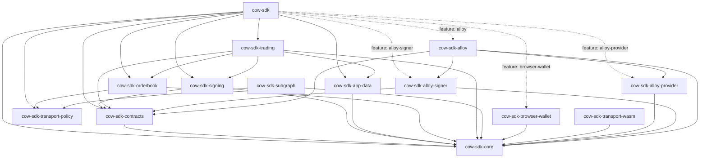

# Architecture

`cow-rs` is a small family of focused crates. The facade crate exists for
ergonomics; the leaf crates own behavior.



## Crate Roles

| Crate | Role | Use when |
| --- | --- | --- |
| `cow-sdk` | Thin public facade | You want the main Rust SDK entrypoint. |
| `cow-sdk-core` | Shared domain types, config, validation, runtime traits, and the `HttpTransport` seam with its native `ReqwestTransport` default | You need the common typed contracts. |
| `cow-sdk-transport-policy` | Shared HTTP retry, rate-limit, jitter, `Retry-After`, and transport classification policy | You need consistent transport behavior across typed clients. |
| `cow-sdk-contracts` | `alloy::sol!`-generated typed bindings, the typed `Registry` deployment authority, and deterministic hashing and verification helpers | You need ABI-level, address-authority, or settlement-level primitives. |
| `cow-sdk-signing` | Typed-data, signing, cancellation, UID helpers, and the `Eip1271VerificationCache` default implementations | You need signing without the full trading layer. |
| `cow-sdk-app-data` | App-data encoding, schema handling, and CID behavior | You need app-data generation or validation. |
| `cow-sdk-orderbook` | Typed orderbook transport over the `HttpTransport` seam, with the `OrderBookApiBuilder` typestate | You need explicit request and response control. |
| `cow-sdk-trading` | Quote-to-order workflows | You need the main trading orchestration layer. |
| `cow-sdk-subgraph` | Read-only subgraph access over the `HttpTransport` seam, with the `SubgraphApiBuilder` typestate | You need GraphQL reads or custom subgraph queries. |
| `cow-sdk-transport-wasm` | Browser-target `HttpTransport` implementation (`FetchTransport`) | You build for `wasm32-unknown-unknown` and need the shipped browser default. |
| `cow-sdk-browser-wallet` | Browser-runtime wallet integration | You need EIP-1193 wallet flows in WASM. |
| `cow-sdk-alloy-provider` | Native Alloy-backed `AsyncProvider` adapter | You need read-only chain RPC through Alloy without a signer dependency. |
| `cow-sdk-alloy-signer` | Native Alloy-backed local private-key `AsyncSigner` adapter | You need local message or EIP-712 signing without provider-backed transaction submission. |
| `cow-sdk-alloy` | Composed native Alloy provider plus signer adapter | You need one native client for `AsyncProvider`, `AsyncSigningProvider`, and `AsyncSigner` helper flows. |

## Layering

| Layer | Crates | Responsibility |
| --- | --- | --- |
| Foundation | `cow-sdk-core` | Shared domain model, runtime seams, and the `HttpTransport` trait |
| Deterministic protocol transforms | `cow-sdk-contracts`, `cow-sdk-signing`, `cow-sdk-app-data` | Typed bindings, registry authority, hashing, signing, app-data, and compatibility logic |
| Client policy | `cow-sdk-transport-policy` | Shared retry, cooldown, rate-limit, and classification behavior above the raw transport seam |
| Client | `cow-sdk-orderbook`, `cow-sdk-subgraph` | Typed HTTP and GraphQL access through the `HttpTransport` seam |
| Workflow | `cow-sdk-trading` | Quote, submit, cancel, approve, and related flows |
| Runtime adapter | `cow-sdk-browser-wallet`, `cow-sdk-transport-wasm`, `cow-sdk-alloy-provider`, `cow-sdk-alloy-signer`, `cow-sdk-alloy` | Browser-wallet session integration, browser-target HTTP transport, and opt-in native Alloy provider/signer adapters |
| Facade | `cow-sdk` | Curated public entrypoint |

## Facade And Adapter FAQ

### Why `cow-sdk-subgraph` is not part of the default facade

`cow-sdk` stays narrow on purpose. The default facade is the trading-first SDK
entrypoint, while `cow-sdk-subgraph` remains an explicit read-only analytics
crate. Keeping subgraph access separate avoids widening the default dependency
graph for consumers that only need order creation, signing, quoting, and
submission. This matches [ADR 0001](adr/0001-multi-crate-sdk-family-with-thin-facade.md)
and [ADR 0003](adr/0003-separate-read-only-subgraph-crate.md): the facade
optimizes for the main transactional path, and analytics stay opt-in.

### Provider And Signer Adapter Seams

Native runtime integrations plug in through the stable traits owned by
`cow-sdk-core`:

```rust
use cow_sdk_core::{AsyncProvider, AsyncSigner, AsyncSigningProvider, Provider, Signer};
```

The same seam also owns the transaction lifecycle boundary. Signers return
`TransactionBroadcast`, a hash-only broadcast acknowledgement, while provider
receipt lookups return `TransactionReceipt` with optional mined-state fields
such as status, block, gas, sender, and recipient. Adapter implementations must
not turn submission into implicit receipt polling; mined observation stays an
explicit provider call.

The SDK declares its provider, signer, and signing-provider contracts in
`cow-sdk-core` rather than binding trading helpers directly to a concrete
Ethereum runtime library. This lets one trading call site drive native Alloy on
x86 / ARM, the browser-wallet leaf on `wasm32`, or any custom adapter that
implements the same traits. If `cow-sdk-trading` depended on a concrete
provider library directly, the wasm path would have to pull native-only
dependencies or fork trading helpers per runtime.

For most custom native integrations, implement `Provider` and `Signer` on the
adapter type that owns your RPC or signer backend. The blanket implementations
then let that same adapter satisfy the read-only async surface through
`AsyncProvider`, and the signing-capable async surface through
`AsyncSigningProvider` when the signer supports the async contract. Native
Alloy support is already shipped as `cow-sdk-alloy-provider`,
`cow-sdk-alloy-signer`, and `cow-sdk-alloy`; browser-wallet support implements
the async side directly without widening the native facade.

The native Alloy adapter family ships as three crates so a consumer can pull
only the capabilities they exercise: `cow-sdk-alloy-provider` for read-only
RPC, `cow-sdk-alloy-signer` for local private-key signing, and `cow-sdk-alloy`
for the composed read-plus-sign flow that most trading applications need. The
split keeps the provider leaf free of signing-crypto features and lets the
signer leaf stay free of transport plumbing.

The stable public contract is the trait seam itself. Native signer and RPC
integrations remain additive leaf crates so the workspace does not freeze one
provider ecosystem into `core`, `trading`, or the default `cow-sdk` facade.
Use [Integrations](integrations.md) for a worked adapter example.

## Cross-Cutting Contracts

### Runtime Traits

`cow-sdk-core` owns the signer and provider seams used across the workspace.
Sync and async contracts stay explicit, and typed-data payloads stay structured
rather than being reconstructed from ad hoc field lists. Credential-bearing
config stays explicit as input, but the default diagnostic and serialized
surfaces owned by `cow-sdk-core`, `cow-sdk-orderbook`, and `cow-sdk-app-data`
redact secret material instead of treating it as routine log data.
Transaction broadcast and receipt observation stay separate typed results so
callers can reason about submission, inclusion, and execution without
provider-specific timing assumptions.

### Typed Amounts

`cow-sdk-core` keeps three distinct amount roles at the typed boundary.
`Amount` stores unsigned atomic quantities as `BigUint` while preserving
the decimal-string wire form, `DecimalAmount` pairs atoms with a decimals
scale for display and user-input flows, and `SignedAmount` stores signed
deltas as `BigInt` while keeping that same decimal-string wire shape for
serialization. The signed type exposes typed `BigInt` accessors and
delegates addition, subtraction, and checked arithmetic directly to the
underlying integer, following the same typed-boundary discipline that
already governs `Amount`.

### Transport Seams

`cow-sdk` exposes two orthogonal runtime seams that never share a concrete
backend. The `HttpTransport` trait in `cow-sdk-core` is the HTTPS seam used
by `cow-sdk-orderbook` and `cow-sdk-subgraph` for REST and GraphQL
dispatch; native consumers get `ReqwestTransport` from `cow-sdk-core`, and
browser consumers get `FetchTransport` from the dedicated
`cow-sdk-transport-wasm` leaf crate. Retry, cooldown, rate-limit, and
transport-error classification policy lives in `cow-sdk-transport-policy`
so orderbook and subgraph clients keep the same behavior without widening
the raw `HttpTransport` trait. The `AsyncProvider` trait (also in
`cow-sdk-core`) is the read-only chain-RPC seam used by on-chain helpers such
as allowance reads, EIP-1271 verification, and on-chain cancellation. Signer
creation for async-capable providers lives in `AsyncSigningProvider`; no
provider implementation ships by default, so consumers bring their own through
the [Providers](providers/README.md) adapter guide.

The trait is dyn-compatible, so injected clients compose transports behind
`Arc<dyn HttpTransport + Send + Sync>`. Typed failures flow through a single
`TransportError` enum and its `TransportErrorClass` partition, both of
which strip URLs before wrapping so credential-bearing query strings never
surface through `Debug` or `Display`. The full transport story lives in
[Transport](transport.md).

### Transport Ownership

Retry behavior, rate limits, GraphQL request shape, API-key handling, and
pinning semantics stay with the transport crates that own those behaviors.
For subgraph access, stable production metadata and typed request failures
expose only redacted or non-secret route identity while keeping explicit
override support.

Production deployments that issue requests across several chains can pool
a single `reqwest::Client` across every orderbook and subgraph instance
they build. On native targets, `OrderBookApi::builder()` and
`SubgraphApi::builder()` both expose a `.client(shared_client)` convenience
method over `ReqwestTransport` that preserves any custom keep-alive,
timeout, or TLS settings verbatim, so one warm connection cache backs
every chain the consumer routes through. Browser consumers install
`FetchTransport` through the builder's `.transport(...)` setter instead.
The [Performance](performance.md) page records the recommended HTTP/2
keep-alive recipe, shared-client usage pattern, and the knob summary that
accompanies each opt-in setting.

### Cancellation

Long-running public operations on `OrderBookApi`, `SubgraphApi`, and
`TradingSdk` each expose one canonical async method, and callers compose
cooperative cancellation by wrapping the returned future through
`cow_sdk_core::Cancellable::cancel_with(&token)` at the call site. The
`cow_sdk_core::CancellationToken` is a re-export of
`tokio_util::sync::CancellationToken`, so every SDK surface routes
cancellation through the same typed import. The combinator polls the
borrowed token in a biased branch before each inner poll; when the token
fires, the wrapper drops the inner request future so the underlying
socket releases promptly, and the typed `Cancelled` variant on the
relevant error aggregate surfaces at the caller.

For example, the following quotes and posts a swap with a shared
cancellation token:

```rust,ignore
use cow_sdk_core::Cancellable;

let token = cow_sdk_core::CancellationToken::new();
let result = sdk
    .post_swap_order_async(params, &signer, None)
    .cancel_with(&token)
    .await?;
```

Cancellation is cooperative: the caller owns the token, and every SDK
instance that needs to propagate shutdown through a shared token simply
clones it. `From<Cancelled>` bridges on `CoreError`, `OrderbookError`,
`SubgraphError`, `TradingError`, `SigningError`, `BrowserWalletError`, the
native Alloy adapter errors, and the facade `SdkError` lift the marker through
`?` across every public error boundary.

### Workflow Ownership

`cow-sdk-trading` owns quote-to-order orchestration. It composes lower-level
crates instead of spreading user-facing workflow logic across signing,
transport, and contract crates. When callers inject an orderbook client into
orderbook-bound trading helpers, that client becomes the canonical chain and
environment authority; conflicting explicit values are rejected instead of
being silently mixed through precedence fallbacks. When quote results are
reused for posting, the originating orderbook runtime binding remains part of
that contract, so quote-derived submission is rejected if the caller switches
to a different orderbook endpoint, chain, or environment. Reviewed
`sellTokenBalance` and `buyTokenBalance` semantics remain part of the same
workflow contract through quote, order, sign, and post seams. The typestate
builder and its total-input shortcuts share the same injected-orderbook
validation boundary. Ready-state `TradingSdk` construction requires a validated
`AppCode` plus explicit or injected chain authority, while `HelperOnlySdk`
construction remains available for chain-bound helper flows such as allowance,
approval, pre-sign, and on-chain cancellation. Recoverable-signature posting
rejects explicit owner or signer mismatch before submission, and user-facing
partner-fee policy remains typed on trading request surfaces and only crosses
into raw metadata at the explicit app-data translation seam.

For browser-wallet-backed trading flows, chain coherence remains leaf-owned by
`cow-sdk-browser-wallet`. When the workflow already has an explicit chain
authority, `BrowserWallet::signer_for_chain` binds that expectation to the
wallet session so quote, address, signature, gas, and transaction operations
fail fast if the active wallet chain drifts.

Typed browser-wallet chain-management follows the same rule. Successful
`switch_chain` and `switch_or_add_chain` results are returned only after the
refreshed wallet session confirms the requested chain, so switch helpers do
not treat wallet RPC acknowledgement as sufficient authority on its own.

### Browser-Runtime Support

Browser wallet support is a leaf capability, not a hidden default. The root
facade exposes it through an explicit feature, while the full browser-runtime
contract remains owned by `cow-sdk-browser-wallet`. Chain-bound browser-wallet
signers keep live wallet flows aligned with the selected workflow chain without
widening `cow-sdk-trading` into a browser-specific crate, and typed
chain-management helpers confirm refreshed session state before they report
switch success.

## Public Boundary Rules

- `cow-sdk` stays thin.
- Pure transform crates do not perform hidden network I/O.
- `cow-sdk-subgraph` remains a separate read-only crate.
- Browser-wallet method growth stays leaf-owned and typed.
- Orderbook wire DTOs remain string-heavy only at the explicit HTTP boundary.
- Public configs, endpoint discovery, and typed request failures expose only
  redacted or non-secret route identity.
- Reviewed subgraph query constants may be public when they are deliberately
  stabilized, but saved GraphQL breadth beyond that reviewed set and test-only
  schema fixtures stay non-public.
- `OrderBookApi`, `SubgraphApi`, and `TradingSdk` construct exclusively
  through their typestate builders; no free-function public constructors
  remain on any of the three.
- Native Alloy dependencies are confined to the reviewed opt-in adapter crates:
  `alloy-provider` is allowed only in `cow-sdk-alloy-provider` and
  `cow-sdk-alloy`, while `alloy-signer-local` is allowed only in
  `cow-sdk-alloy-signer` and `cow-sdk-alloy`. The default facade stays
  provider-neutral unless an Alloy feature is enabled.
- Every deployed-contract-address lookup routes through the typed
  `Registry` authority; hard-coded chain-scoped address constants are not
  allowed in shipped crates.
- Every ABI binding the SDK emits call-data against is generated through
  `alloy::sol!` from committed upstream Solidity excerpts.

## Related Docs

- [Principles](principles.md)
- [Transport](transport.md)
- [Deployments](deployments.md)
- [Verification Guide](verification-guide.md)
- [Parity Matrix](parity-matrix.md)
- [ADRs](adr/README.md)
