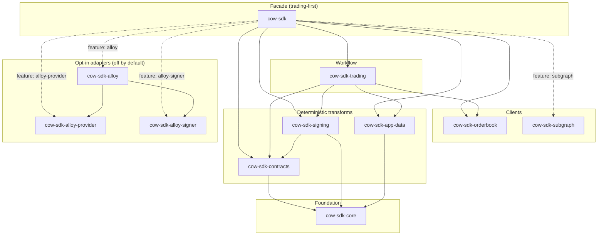
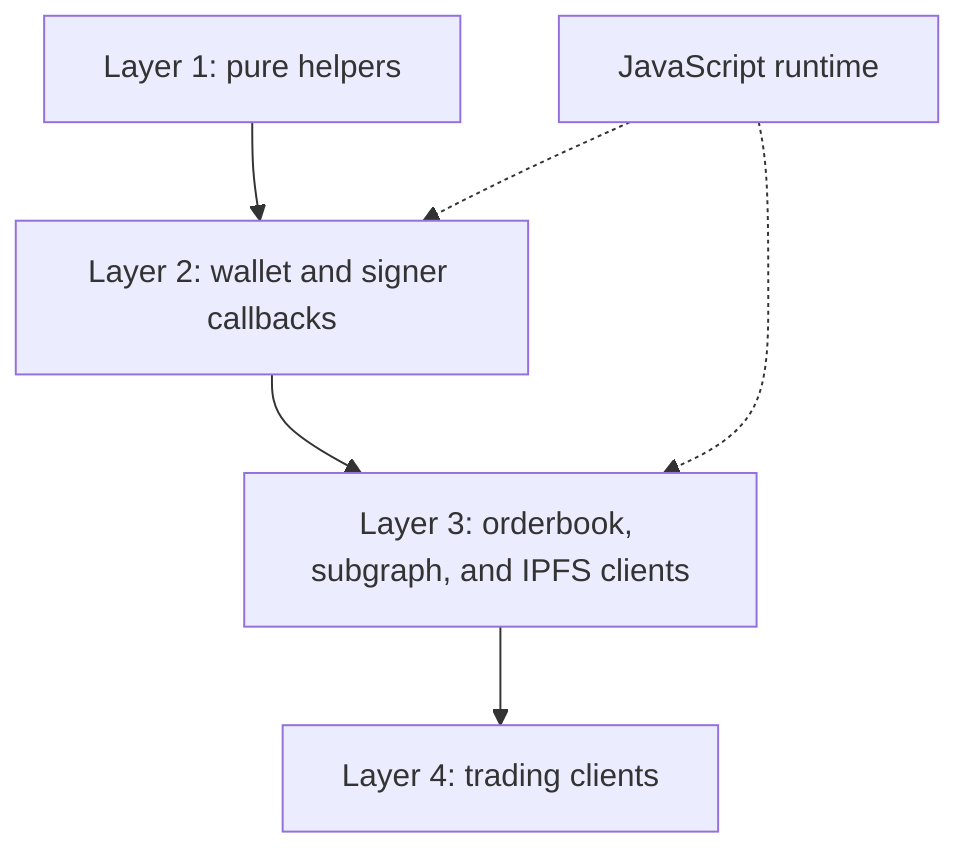

# Architecture

`cow-rs` is a family of focused crates. The `cow-sdk` facade exists for
ergonomics; the leaf crates own behavior. Every crate builds on `cow-sdk-core`.



This is an overview, not a build graph: every crate depends on `cow-sdk-core`,
so only the transform-layer edges to the foundation are drawn, and optional
capabilities appear as dashed `feature:` edges. The `wasm32` leaf `cow-sdk-js`
composes the same crates and is covered under
[JavaScript and TypeScript WASM surface](#javascript-and-typescript-wasm-surface).
The runtime-to-package routing table lives in the root README
([When to use cow-rs](../../README.md#when-to-use-cow-rs)). The internal,
unpublished `cow-sdk-test-utils` helper crate is omitted.

## Crate roles

| Crate | Role | Use when |
| --- | --- | --- |
| `cow-sdk` | Thin public facade | You want the main Rust SDK entrypoint. |
| `cow-sdk-core` | Domain types, config, validation, runtime trait seams, and the `HttpTransport` seam (native `ReqwestTransport`; `wasm32` `FetchTransport` in `transport::fetch`). The opt-in `transport-policy` feature adds the shared retry driver `run_with_retry` with rate-limit, jitter, `Retry-After`, a target-neutral wall clock, and transport-error classification. | You need the common typed contracts, or consistent retry behavior across typed clients. |
| `cow-sdk-contracts` | `alloy::sol!` bindings, the typed `Registry` deployment authority, fail-closed `CoWSwapOnchainOrders` event decoding, hashing/verification helpers, and the gas-free on-chain transaction builders (approve, pre-sign, settlement cancel, eth-flow create/cancel, wrap, unwrap) that return an `UnsignedTransaction` with override-or-registry target resolution. Hosts the opt-in `cow-shed` and `composable` feature-modules. | You need ABI-level, address-authority, or settlement-level primitives. |
| `cow-sdk-signing` | Typed-data, signing, cancellation, UID helpers, and the `Eip1271Cache` seam (the always-available `NoopEip1271Cache`; implement the trait to memoize). | You need signing without the full trading layer. |
| `cow-sdk-app-data` | App-data encoding, schema handling, and CID behavior. | You need app-data generation or validation. |
| `cow-sdk-orderbook` | Typed orderbook transport over the `HttpTransport` seam, built through the `OrderbookApi` typestate builder. | You need the typed quote/post/query surface without compiling the signing stack. |
| `cow-sdk-trading` | Quote-to-order workflows plus the quote, submit, cancel, and approve orchestration surface. | You need the main trading orchestration layer. |
| `cow-sdk-subgraph` | Read-only subgraph access over the `HttpTransport` seam, built through the `SubgraphApi` typestate builder. | You need GraphQL reads or custom subgraph queries (via the `cow-sdk` `subgraph` feature or this crate directly). |
| `cow-sdk-js` | wasm-bindgen bindings for JavaScript and TypeScript over the deterministic helpers, typed wallet callbacks, orderbook/subgraph/IPFS clients, and trading flows. | JavaScript or TypeScript should call the SDK through wasm exports, including host-wallet flows. |
| `cow-sdk-alloy-provider` | Native Alloy-backed `Provider` adapter. | You need read-only chain RPC through Alloy without a signer dependency. |
| `cow-sdk-alloy-signer` | Native Alloy-backed local private-key `Signer` adapter. | You need local message or EIP-712 signing without provider-backed submission. |
| `cow-sdk-alloy` | Composed native Alloy provider plus signer. | You need one native client for `Provider`, `LogProvider`, `SigningProvider`, and `Signer` flows. |
| `cow-sdk-test` | Published in-memory test doubles for the public trait seams (`OrderbookClient`, `Signer`, `Provider`/`SigningProvider`), surfaced through the facade `testing` feature as `cow_sdk::testing`. | You want to test your integration with no live orderbook, RPC, or wallet (a dev-dependency). |

Client type names track altitude: transport clients carry the `Api` suffix
(`OrderbookApi`, `SubgraphApi`) because they wrap a REST or GraphQL API, while
the orchestration client is the bare domain noun `Trading`.

## Layering

| Layer | Crates | Responsibility |
| --- | --- | --- |
| Foundation | `cow-sdk-core` | Domain model, runtime seams, and the `HttpTransport` trait |
| Deterministic transforms | `cow-sdk-contracts`, `cow-sdk-signing`, `cow-sdk-app-data` | Bindings, registry authority, hashing, signing, and app-data |
| Client policy | `cow-sdk-core` (`transport-policy`) | Shared retry, cooldown, rate-limit, and classification above the raw seam |
| Client | `cow-sdk-orderbook`, `cow-sdk-subgraph` | Typed HTTP and GraphQL access through `HttpTransport` |
| Workflow | `cow-sdk-trading` | Quote, submit, cancel, and approve flows |
| Runtime adapter | `cow-sdk-alloy-provider`, `cow-sdk-alloy-signer`, `cow-sdk-alloy` | Opt-in native Alloy adapters (the browser transport ships inside `cow-sdk-core`) |
| WASM leaf | `cow-sdk-js` | Typed wasm-bindgen exports and JavaScript callbacks |
| Facade | `cow-sdk` | Curated public entrypoint |
| Test support | `cow-sdk-test` | Published trait doubles, off the default dependency graph |

## JavaScript and TypeScript WASM surface

`cow-sdk-js` is a peer leaf, not a replacement for the native facade or for the
upstream `@cowprotocol/cow-sdk` TypeScript SDK. For most browser dapps the
upstream SDK is the smaller bundle at an equivalent feature subset. `cow-sdk-js`
fits deterministic Rust signing parity, single-source Rust + TypeScript
embedding, and Cloudflare Workers (the `trading` flavour's edge build is tested
end-to-end in CI within the Workers compressed-size budget). It publishes to npm
as `@symbiome-forge/cow-sdk-wasm`.

Its surface has four layers — pure deterministic helpers, wallet and signer
callbacks, orderbook/subgraph/IPFS clients, and trading clients — reusing the
same Rust helpers native consumers call and crossing into JavaScript only at
typed wasm-bindgen exports and callbacks.



A second WebAssembly lane, the language-neutral component `cow-sdk-component`,
is a `publish = false` leaf that compiles the same core and clients to
`wasm32-wasip2` against a typed WIT contract for native hosts and polyglot
consumers through Wasmtime and jco. Its distribution channel is deferred and
experimental; see [ADR 0071](../adr/0071-wasm-component-distribution-channel.md).

## TypeScript facade

After publication, the npm package wraps raw wasm-bindgen output behind a
TypeScript facade: camelCase APIs, named callback types, explicit `dispose()`
methods on client classes, and normalized `CowError` values. It also adapts
`transport: { kind: "fetch" }` into the callback transport ABI, so browser,
Node.js, and Worker consumers share one constructor shape. Generated
wasm-bindgen modules stay package-internal.

## Provider and signer adapter seams

Native runtime integrations plug in through the stable traits owned by
`cow-sdk-core`:

```rust
use cow_sdk_core::{Provider, Signer, SigningProvider};
```

The same seam owns the transaction lifecycle boundary. Signers return
`TransactionBroadcast`, a hash-only broadcast acknowledgement; provider receipt
lookups return `TransactionReceipt` with optional mined-state fields (status,
block, gas, sender, recipient). Adapters must not turn submission into implicit
receipt polling — mined observation stays an explicit provider call.

Declaring these contracts in `cow-sdk-core`, rather than binding trading helpers
to a concrete Ethereum library, lets one trading call site drive native Alloy on
x86/ARM, a host-supplied EIP-1193 wallet on `wasm32`, or any custom adapter:

- For a custom RPC backend, implement `Provider`; for a signer backend,
  implement `Signer`. The narrower [`TypedDataSigner`] and [`DigestSigner`]
  capability traits ([ADR 0045](../adr/0045-async-signer-trait-narrowing.md))
  remain available for callback-shaped adapters that expose only one signing
  operation, and `Signer::address` serves owner resolution.
- Wallet-capable adapters implement `SigningProvider` (extends `Provider` with
  signer creation). Adapters that fetch event logs implement `LogProvider`
  ([ADR 0057](../adr/0057-log-provider-capability-trait.md)); its `get_logs`
  performs one bounded query over an address set and the four EVM topic slots,
  so indexed arguments such as an event's `owner` filter server-side, feeding
  the fail-closed event decoders.
- For JavaScript and TypeScript, `cow-sdk-js` exposes the same trait surface as
  typed callbacks — including the typed-data signer callback
  ([ADR 0040](../adr/0040-wallet-provider-callback-boundary-for-js-consumers.md)) —
  so the host's own wallet stack (viem, wagmi, or any EIP-1193 provider) supplies
  the connection without widening the native facade.

Native Alloy support ships as three crates so a consumer pulls only what they
exercise: `cow-sdk-alloy-provider` (read-only RPC), `cow-sdk-alloy-signer`
(local private-key signing), and `cow-sdk-alloy` (the composed read, log-fetch,
and sign client most trading applications need). The split keeps the provider
leaf free of the private-key signer and the order-signing surface, and keeps the
signer leaf free of transport plumbing. The stable public contract is the trait
seam itself; native integrations stay additive leaf crates so the workspace
never freezes one provider ecosystem into `core`, `trading`, or the default
facade. See [Integrations](integrations.md) for a worked adapter example.

## Why the subgraph crate is opt-in

The default `cow-sdk` facade is the trading-first entrypoint; read-only subgraph
analytics are an explicit opt-in. Enable the `subgraph` feature
(`cow-sdk = { features = ["subgraph"] }`) to reach it as `cow_sdk::subgraph`, or
depend on `cow-sdk-subgraph` directly. Because the feature is off by default,
consumers that only need order creation, signing, quoting, and submission pay no
subgraph dependency. This matches
[ADR 0001](../adr/0001-multi-crate-sdk-family-with-thin-facade.md) and
[ADR 0003](../adr/0003-separate-read-only-subgraph-crate.md).

The composable-order capability ships the same way: as the off-by-default
`composable` feature-module of `cow-sdk-contracts` (no separate crate, per
[ADR 0048](../adr/0048-composable-conditional-order-framework.md)), with the
shared `Registry` resolving composable contract addresses.

## Cross-cutting contracts

### Primitive layer

`alloy_primitives` is the canonical EVM primitive layer and `alloy_sol_types`
the canonical EIP-712 / Solidity-binding layer
([ADR 0052](../adr/0052-alloy-primitives-canonical-primitive-layer.md)). The
cow-named identity and numeric types are `#[repr(transparent)]` newtypes over
the matching `alloy_primitives` type. `TypedDataDomain` is a cow-owned
`#[non_exhaustive]` struct that emits the canonical wire shape through its own
`Serialize` and bridges to `alloy_sol_types::Eip712Domain` via `to_alloy_domain()`
at the hashing seam.

### Runtime traits

`cow-sdk-core` owns the signer and provider seams. The trait surface is async by
construction, and typed-data payloads stay structured rather than rebuilt from
ad hoc field lists. Credential-bearing config stays explicit as input, but the
default diagnostic and serialized surfaces redact secret material instead of
logging it. Broadcast and receipt observation stay separate typed results, so
callers reason about submission and inclusion without provider-specific timing
assumptions.

### Typed amounts

`Amount` is a `#[repr(transparent)]` newtype over `alloy_primitives::U256`
([ADR 0052](../adr/0052-alloy-primitives-canonical-primitive-layer.md)) carrying
the atomic quantity that crosses the wire. Human-readable conversions go through
`Amount::from_units(whole, decimals)`, `Amount::parse_units(value, decimals)`,
and `Amount::format_units(decimals)`, which scale by `10^decimals` with integer
arithmetic so the round trip stays exact. Arithmetic is fallible by return —
`checked_*` (returning `Option`) and explicit `saturating_*` clamps — with no
bare `Add`/`Sub`/`Mul` operators, so a typed amount can never silently wrap; a
caller that needs raw wrapping reaches through `as_u256`/`into_u256`. The wire
`Deserialize` is strict-decimal-only; the `Amount::new` constructor stays
lenient.

### Transport seams

`cow-sdk` exposes two orthogonal runtime seams that never share a backend. The
`HttpTransport` trait is the HTTPS seam used by `cow-sdk-orderbook` and
`cow-sdk-subgraph`; native consumers get `ReqwestTransport`, browser consumers
get `FetchTransport` (`cow-sdk-core`'s `transport::fetch` module, the `wasm32`
sibling of `ReqwestTransport`). The shared retry driver and policy live in the
opt-in `transport-policy` feature, so the orderbook, subgraph, and IPFS clients
run every attempt through one retry loop with identical behavior on native and
browser. The `Provider` trait is the read-only chain-RPC seam used by allowance
reads, EIP-1271 verification, and on-chain cancellation; signer creation lives
in `SigningProvider`. No provider implementation ships by default — consumers
bring their own through the [Providers](../providers/index.md) guide.

The trait is dyn-compatible, so injected clients compose transports behind
`Arc<dyn HttpTransport + Send + Sync>`. Typed failures flow through one
`TransportError` enum and its `TransportErrorClass` partition, both of which
strip URLs before wrapping so credential-bearing query strings never surface
through `Debug` or `Display`. Retry behavior, rate limits, GraphQL shape, and
API-key handling stay with the transport crates that own them. On native
targets, `OrderbookApi::builder()` and `SubgraphApi::builder()` expose
`.client(shared_client)` over `ReqwestTransport`, so one warm `reqwest::Client`
can back every chain a consumer routes through; browser consumers install
`FetchTransport` through the builder's `.transport(...)` setter. The full story
is in [Transport](transport.md); the keep-alive recipe is in
[Performance](performance.md).

### Cancellation

Long-running operations on `OrderbookApi`, `SubgraphApi`, and `Trading` each
expose one canonical async method; callers add cooperative cancellation by
wrapping the returned future with `Cancellable::cancel_with(&token)` at the call
site. `cow_sdk_core::CancellationToken` re-exports
`tokio_util::sync::CancellationToken`. The combinator polls the borrowed token in
a biased branch before each inner poll; when it fires, the wrapper drops the
inner future so the socket releases promptly, and a typed `Cancelled` variant
surfaces on the relevant error aggregate.

```rust,ignore
use cow_sdk_core::Cancellable;

let token = cow_sdk_core::CancellationToken::new();
let result = trading
    .post_swap_order(params, &signer, None)
    .cancel_with(&token)
    .await?;
```

`From<Cancelled>` bridges on `CoreError`, `OrderbookError`, `SubgraphError`,
`TradingError`, `SigningError`, the native Alloy adapter errors, and the facade
`CowError`, so the marker lifts through `?` across every public error boundary.

### Workflow ownership

`cow-sdk-trading` owns quote-to-order orchestration; it composes lower-level
crates instead of spreading workflow logic across signing, transport, and
contract crates. Each operation is offered at complementary layers
([ADR 0069](../adr/0069-layered-trading-operation-surface-and-signing-free-transport.md)):
a stateless free function, a method on the bound `Trading` client that resolves
stored chain, app-code, and orderbook context before delegating to it, and the
fluent `Trading::swap()` and `Trading::limit()` builders whose named setters make
the token and amount pairs non-transposable. Each higher layer is a thin
delegation to the one below. Order placement lives here, not on the orderbook
client, because it signs, generates app-data, and resolves eth-flow contracts —
so `cow-sdk-orderbook` and `cow-sdk-subgraph` stay signing-free typed transport
clients.

When a caller injects an orderbook client, that client becomes the canonical
chain and environment authority: conflicting explicit values are rejected, not
silently merged. Quote-derived submission carries the originating runtime
binding, so it is rejected if the caller switches orderbook endpoint, chain, or
environment. Ready-state `Trading` construction requires a validated `AppCode`
plus explicit or injected chain authority; chain-bound helpers that need no app
code — allowance, approval, pre-sign, and on-chain cancellation — are the crate's
free functions. Recoverable-signature posting rejects owner/signer mismatch
before submission. These guarantees hold regardless of which `Signer` and
`Provider` back the workflow.

### Browser runtime support

Browser and wallet integration is served to JavaScript and TypeScript consumers
by `cow-sdk-js` plus the host's own wallet stack (viem, wagmi, or any EIP-1193
provider). The SDK owns the typed callback boundary
([ADR 0040](../adr/0040-wallet-provider-callback-boundary-for-js-consumers.md))
and the wasm surface
([ADR 0039](../adr/0039-typescript-callable-wasm-sdk-surface.md)); the host
supplies the connection. The native facade stays free of any browser-specific
crate, and chain coherence is enforced at the workflow level through the same
`Signer`/`Provider` seams native consumers use.

## Public boundary rules

- `cow-sdk` stays thin; pure transform crates perform no hidden network I/O.
- The fluent order-lifecycle builder lives in `cow-sdk-trading`;
  `cow-sdk-orderbook` and `cow-sdk-subgraph` depend on no signing crate and host
  no order-lifecycle builder, so the typed transport stays usable without the
  signing stack.
- `cow-sdk-subgraph` stays a separate read-only crate, re-exported through
  `cow-sdk` only behind the off-by-default `subgraph` feature.
- Wallet integration crosses into the host through the typed callbacks in
  `cow-sdk-js`; the SDK owns the callback shape, not the connection.
- `OrderbookApi`, `SubgraphApi`, and `Trading` construct exclusively through
  their typestate builders; no free-function public constructors remain.
- Native Alloy dependencies are confined to the reviewed adapter crates:
  `alloy-provider` only in `cow-sdk-alloy-provider`/`cow-sdk-alloy`,
  `alloy-signer-local` only in `cow-sdk-alloy-signer`/`cow-sdk-alloy`. The
  default facade stays provider-neutral unless an Alloy feature is enabled.
- Every deployed-contract-address lookup routes through the typed `Registry`;
  hard-coded chain-scoped address constants are not allowed in shipped crates.
- Every ABI the SDK emits call-data against is declared inline with
  `alloy::sol!` and proven byte-for-byte against the upstream protocol by the
  TypeScript-SDK-derived fixtures under `parity/fixtures/`; the upstream Solidity
  each binding mirrors is pinned by commit in `parity/source-lock.yaml`.
- On-chain order event logs (`CoWSwapOnchainOrders` `OrderPlacement` /
  `OrderInvalidation`) decode through a fail-closed, provider-free decoder that
  validates every field and never panics on adversarial input.
- Public configs, endpoint discovery, and typed request failures expose only
  redacted or non-secret route identity.

## Related docs

- [Principles](../principles/index.md)
- [Transport](transport.md)
- [Deployments](deployments.md)
- [Verification](verification.md)
- [Parity And Provenance](parity.md)
- [ADRs](../adr/index.md)
