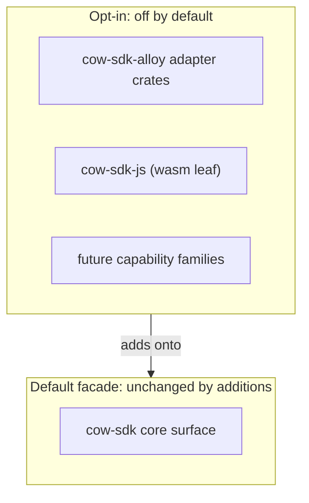

# Additive Optional Ecosystems

**Invariant** — Optional capabilities grow through leaf crates and feature-gated additions.
Provider-specific behavior, JavaScript and TypeScript wasm integration, and future capability
families do not silently widen the default facade contract.

**Why** — If an optional capability widens the default build, every consumer pays for it in
compile time, binary size, and API surface — the opposite of opt-in.

**How to comply**
- Ship a new capability as a leaf crate or an off-by-default Cargo feature.
- Leave the default facade contract unchanged when adding an optional family.

**Shape**

**Enforced by** — `crates/js/tests/wasm_flavour_reachability_contract.rs` proves each wasm
flavour's bindings stay reachable (an under-gated feature leaking into a leaner build fails),
backed by the `check-wasm-invariant` gate.

**Anchored by**: [ADR 0001](../adr/0001-multi-crate-sdk-family-with-thin-facade.md) (primary). Supporting: [ADR 0071](../adr/0071-wasm-component-distribution-channel.md).
