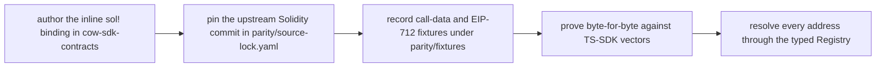

# Canonical Contract Bindings

**Invariant** — Every ABI binding the SDK emits call-data against is authored as an inline
`alloy::sol!` interface in `cow-sdk-contracts` and proven byte-for-byte against TypeScript-SDK
call-data and EIP-712 digest fixtures under `parity/fixtures/`. The upstream Solidity each binding
mirrors is pinned by commit in `parity/source-lock.yaml`. Hand-rolled encoders are not allowed in
shipped crates, and every chain-scoped address lookup routes through the typed `Registry`. The
canonical EVM primitive layer is `alloy_primitives` and the canonical EIP-712 / Solidity-binding
layer is `alloy_sol_types` per [ADR 0052](../adr/0052-alloy-primitives-canonical-primitive-layer.md).

**Why** — A hand-rolled or unpinned encoder can silently diverge from the deployed contract and
produce call-data that reverts — or, worse, settles something other than the signed intent.

**How to comply**
- Author the binding as an inline `alloy::sol!` interface in `cow-sdk-contracts`.
- Pin the upstream Solidity commit, record call-data and EIP-712 fixtures, and prove
  byte-for-byte against the TypeScript-SDK vectors.
- Resolve every chain-scoped address through the typed `Registry` — never a literal.

**Pipeline** — the full lifecycle of a canonical binding; skipping any step (especially the pin
or the fixture) is what the gates refuse:

**Enforced by** — `crates/contracts/tests/parity_contract.rs` proves the `sol!` bindings match the
pinned fixtures; `check-alloy-family-pins` keeps the alloy train in lockstep; the
`encode`-prefixed source fences ban hand-rolled encoders.

**Anchored by**: [ADR 0012](../adr/0012-alloy-sol-bindings-and-registry-authority.md) (primary). Supporting: [ADR 0020](../adr/0020-ethflow-owner-threading.md), [ADR 0022](../adr/0022-ecdsa-signature-v-normalization.md), [ADR 0052](../adr/0052-alloy-primitives-canonical-primitive-layer.md), [ADR 0054](../adr/0054-onchain-order-event-decoding-is-fail-closed.md).

**Operational doctrine**: [Alloy Doctrine](../guides/alloy-doctrine.md) — the three-bucket
classification (ALWAYS-ALLOY, COW-OWNED, BOUNDARY-ADAPTER) and the decision tree for when a new
primitive joins each bucket.
