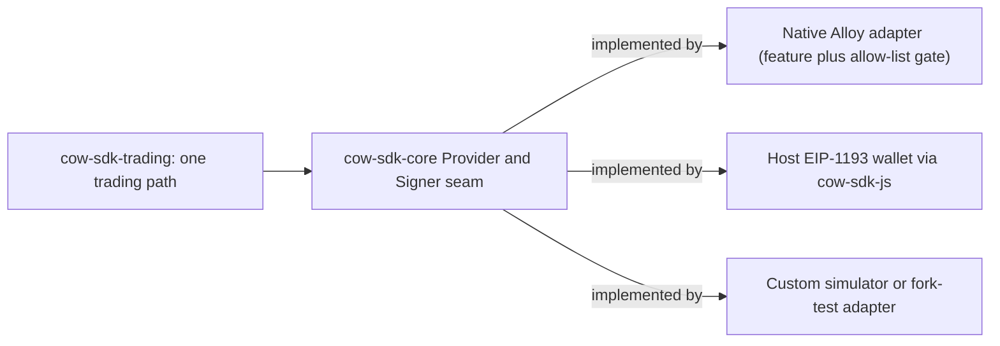

# Chain-RPC Runtime Neutrality

**Invariant** — The default SDK path stays provider-neutral. Consumers own their chain-RPC
runtime through the `Provider` seam in `cow-sdk-core`, while native Alloy support is available
only through explicit adapter crates and facade features. The `alloy-provider` and
`alloy-signer-local` allow-list checks are release-gating invariants, not aspirations.

**Why** — Binding the default path to one provider library forces every consumer onto it. The
trait seam is the mechanism that keeps a single trading path working across native Alloy, a
host-supplied EIP-1193 wallet reached through the `cow-sdk-js` callback, and a custom simulator
or fork-test adapter — all satisfying the same helper calls without widening the default facade.

**How to comply**
- Depend on the `cow-sdk-core` `Provider` / `Signer` traits, never a concrete provider library.
- Ship native-Alloy support as an adapter crate behind a facade feature.

**Shape**

**Enforced by** — the `check-alloy-provider-invariant` and `check-alloy-signer-invariant` policy
gates (`xtask/src/policy/dependency_invariant.rs`) prove `alloy-provider` and `alloy-signer-local`
appear only in the two adapter crates, never on the default path.

**Anchored by**: [ADR 0024](../adr/0024-asyncprovider-asyncsigningprovider-capability-split.md) (primary). Supporting: [ADR 0010](../adr/0010-runtime-neutral-async-and-transport-posture.md), [ADR 0014](../adr/0014-eip1271-verification-cache.md), [ADR 0028](../adr/0028-account-abstraction-integration-plan.md), [ADR 0057](../adr/0057-log-provider-capability-trait.md), [ADR 0068](../adr/0068-payload-only-typed-data-signing.md).

**Operational doctrine**: [Alloy Doctrine](../guides/alloy-doctrine.md) — the three-bucket
classification (ALWAYS-ALLOY, COW-OWNED, BOUNDARY-ADAPTER) and the decision tree for when a new
primitive joins each bucket.
