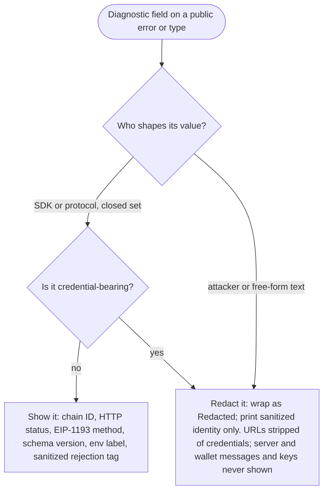

# Credential Redaction by Construction

**Invariant** — Credential-bearing types use the workspace `Redacted<T>` wrapper; their `Debug`,
`Display`, `Serialize`, and panic-path renderings emit only sanitized identity. Safe diagnostics
— chain IDs, HTTP status codes, EIP-1193 method names, schema versions, environment labels,
sanitized rejection tags, and closed-set protocol identifiers — stay visible; free-form echoes
such as server descriptions and wallet messages, and any credential-bearing payload, stay
redacted. No code path bypasses redaction through `Deref` or a transparent re-export of the inner
string. Credential types in the native Alloy adapters likewise avoid derived `Debug`.

**Why** — One `Debug` or `Display` that prints a bearer token, private key, or an RPC URL with an
embedded key leaks that credential into logs permanently.

**How to comply**
- Wrap every credential in `Redacted<T>`; expose only sanitized identity through `Debug` /
  `Display` / `Serialize`.
- Decide each diagnostic field by the rule below: closed-set / safe metadata is shown;
  attacker-shaped or free-form text is redacted.

**Decision**

**Enforced by** — `crates/sdk/tests/error_redaction_contract.rs` renders every reviewed error
family with URL, bearer-token, private-key, and PEM payloads across `Debug`/`Display`/`Serialize`
and asserts no secret appears; `check-wasm-invariant` rejects `Redacted::into_inner` in wasm error
mapping.

**Anchored by**: [ADR 0025](../adr/0025-workspace-url-redaction-convention.md) (primary). Supporting: [ADR 0005](../adr/0005-boundary-specific-runtime-contracts-and-strong-domain-types.md), [ADR 0010](../adr/0010-runtime-neutral-async-and-transport-posture.md).
