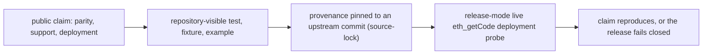

# Evidence-Backed Public Claims

**Invariant** — Compatibility, support posture, parity, and release claims must be justified by
repository-visible tests, examples, fixtures, and reproducible validation documentation.
Source-lock provenance is reproducible from the upstream commit hash; local snapshots are
reference-only and never substitute for git checkouts at the pinned commits. Wire-DTO coverage is
driven by the source-lock-pinned OpenAPI inventory — distinct schemas map to distinct Rust types
so an auction-only field never leaks onto an ordinary order. Deployment authority is backed by the
typed `Registry` (each address pinned to an upstream `source_commit` plus its CREATE2 address) and
confirmed by a release-mode live `eth_getCode` probe; missing production-chain RPCs and absent
deployments are never silently allowed.

**Why** — An unbacked claim — "parity-complete", "this address is canonical" — is a liability the
moment it is wrong. Evidence makes every claim falsifiable and reproducible by a third party.

**How to comply**
- Back each public claim with a repository-visible test, fixture, or example.
- Pin provenance to an upstream commit and reproduce from a git checkout, not a local snapshot.
- Confirm deployments with the release-mode `eth_getCode` probe.

**Pipeline**

**Enforced by** — `check-property-citations` requires every property row's cited evidence to be a
real `#[test]`; `docs-agree` keeps the published release-gate commands identical across docs and
CI; `audit-index` keeps audit review dates in sync.

**Anchored by**: [ADR 0026](../adr/0026-alloy-major-release-absorption-plan.md) (primary). Supporting: [ADR 0025](../adr/0025-workspace-url-redaction-convention.md), [ADR 0030](../adr/0030-workspace-locked-versioning-tag-baseline.md), [ADR 0032](../adr/0032-deployment-authority-machine-readable-provenance.md), [ADR 0052](../adr/0052-alloy-primitives-canonical-primitive-layer.md), [ADR 0066](../adr/0066-trading-slippage-and-suggestion-policy.md).
