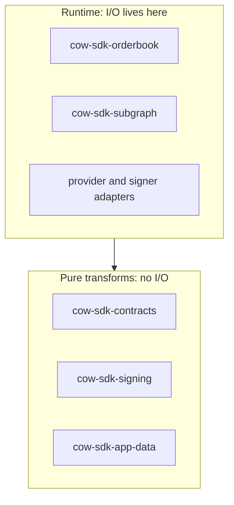

# Explicit Runtime Boundaries

**Invariant** — Pure transform crates do not perform hidden HTTP, RPC, GraphQL, or pinning I/O.
Runtime interaction belongs in explicit clients and adapters.

**Why** — Hidden I/O in a "pure" crate makes it untestable offline, drags networking
dependencies into consumers that only wanted encoders, and buries latency and failure behind
calls that look free.

**How to comply**
- Keep the encode/decode/hash crates (`contracts`, `signing`, `app-data`, core transforms) free
  of network calls.
- Put HTTP, RPC, and GraphQL behind the orderbook/subgraph clients and the provider seam.

**Shape**

**Enforced by** — partial. The `rest-transport-stack` fence (`xtask/src/policy/fences.rs`) bars
JSON-RPC and alloy-transport types from the REST client and transform crates; the broader
"no hidden I/O" rule is otherwise documentation-only.

**Anchored by**: [ADR 0010](../adr/0010-runtime-neutral-async-and-transport-posture.md) (primary). Supporting: [ADR 0055](../adr/0055-bounded-response-reads.md).
