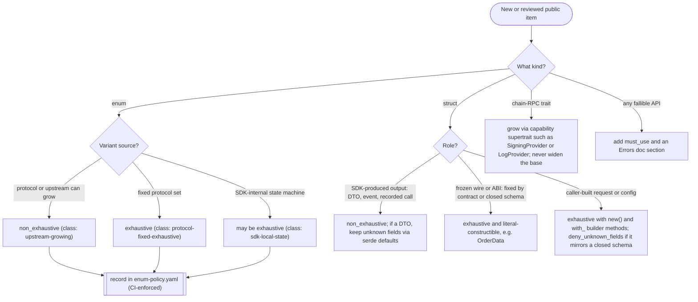

# Forward-Compatible Public Surfaces

**Invariant** — Every public type can absorb additive upstream or protocol growth without a
breaking change, *or* is deliberately frozen because growth there is itself a protocol or schema
change. Public response DTOs preserve unknown fields under `serde` defaults; frozen chain-RPC
traits grow through opt-in capability supertraits, never by widening the base; fallible public
APIs carry `#[must_use]` and a `# Errors` doc section.

**Why** — A surface that breaks on every upstream addition forces a major version for routine
protocol growth; a surface left open where it should be frozen hides a protocol change as an
innocuous minor.

**How to comply**
- Classify every public enum in `enum-policy.yaml`; `upstream-growing` enums carry `#[non_exhaustive]`.
- Pick a struct posture by role — walk the decision below.
- Keep response DTOs on `serde` defaults (preserve unknown fields), not `deny_unknown_fields`.

**Decision**

**Enforced by** — `check-enum-policy` validates the manifest; the `missing_errors_doc`,
`missing_panics_doc`, and `must_use_candidate` clippy lints (warn in `Cargo.toml`) are promoted to
hard errors by `cargo clippy -- -D warnings` in the quality gate.

**Anchored by**: [ADR 0031](../adr/0031-wire-dto-openapi-driven-with-order-auction-order-split.md) (primary). Supporting: [ADR 0027](../adr/0027-post-quantum-signing-absorption-plan.md), [ADR 0058](../adr/0058-typed-quote-request-response-surface.md).
