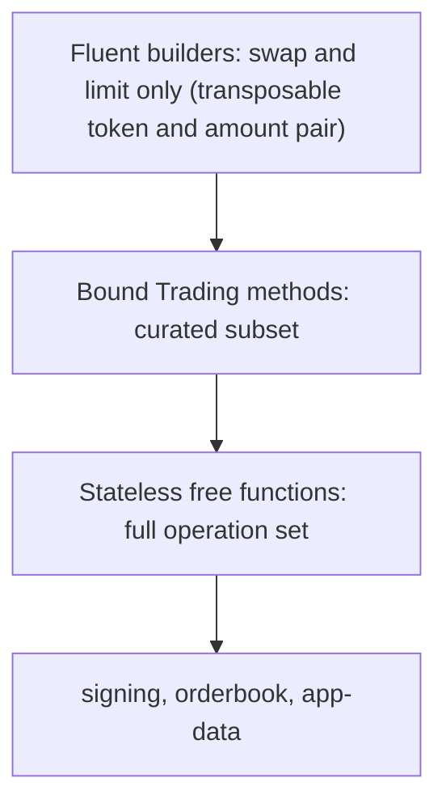

# Layered Operation Surface

**Invariant** — High-level trading operations are offered at complementary layers — stateless
free functions, methods on a bound `Trading` client, and fluent builders for the order-placement
operations (`swap` and `limit`) — where each higher layer is a thin delegation to the one below.
The bound-client method layer is a curated subset of the free functions, not a full mirror; the
fluent builders cover only order-placement operations, whose positional constructors carry
transposable token and amount pairs, and are not added for operations without such a pair
(cancellation, pre-sign, allowance, approval). The fluent builder lives in `cow-sdk-trading`
(where signing, app-data, and eth-flow already are); `cow-sdk-orderbook` and `cow-sdk-subgraph`
stay signing-free typed transport clients. Each operation is reachable by one public import path.

**Why** — Different callers want different ergonomics, but without one-import-path-per-operation
and strict thin delegation the three layers drift into three diverging implementations.

**How to comply**
- Implement the operation once at the free-function layer; make the bound method and the builder
  thin delegations to it.
- Add a fluent builder only for an order-placement operation with a transposable token/amount
  pair — never for cancellation, pre-sign, allowance, or approval.

**Shape**

**Enforced by** — documentation-only (unenforced). No test asserts the one-import-path rule or
the delegation layering today; an import-path/layer test is a candidate future hardening.

**Anchored by**: [ADR 0069](../adr/0069-layered-trading-operation-surface-and-signing-free-transport.md) (primary). Supporting: [ADR 0002](../adr/0002-dedicated-trading-orchestration-crate.md), [ADR 0013](../adr/0013-http-transport-injection-and-typestate-builders.md), [ADR 0070](../adr/0070-onchain-transaction-helper-boundary.md).
