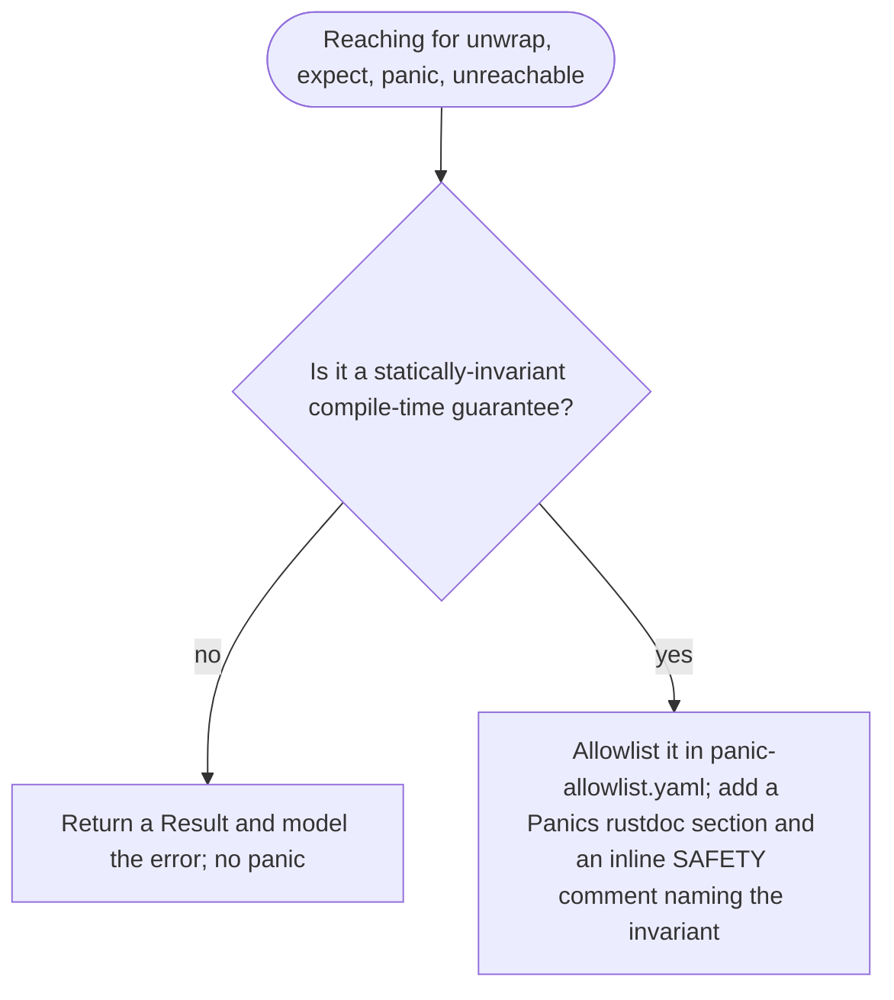

# Minimum-Viable Panic Surface

**Invariant** — Production code in shipped crates contains no
`unwrap`/`expect`/`panic!`/`unreachable!`/`todo!`/`unimplemented!` outside statically-invariant
compile-time guarantees. Each allowed panic site carries a `# Panics` rustdoc section on its
public function and an inline `// SAFETY:` comment naming the build-time invariant.
`.github/config/panic-allowlist.yaml` keys allowed sites by item path; the regression contract
fails on uncommented additions.

**Why** — A panic in a library is a denial-of-service for the consumer's process. The only
acceptable ones are sites a compiler-proven invariant makes genuinely unreachable.

**How to comply**
- Return a `Result` and model the error instead of unwrapping.
- If a site is truly statically invariant, allowlist it and document why — walk the rule below.

**Decision**

**Enforced by** — `check-panic-allowlist` (`xtask/src/policy/check_panic_allowlist.rs`) fails on
any panic-bearing call in a shipped crate that is not allowlisted, and requires the `# Panics`
doc and `// SAFETY:` comment on every allowlisted site.

**Anchored by**: [ADR 0033](../adr/0033-minimum-viable-panic-surface.md) (primary). Supporting: none.
