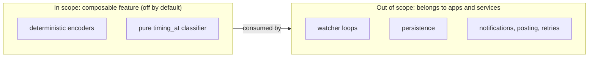

# Off-Chain Orchestration Boundary

**Invariant** — The composable order surface ships as the off-by-default `composable`
feature-module per [ADR 0048](../adr/0048-composable-conditional-order-framework.md). Its helpers
are bounded to deterministic encoders plus the pure `timing_at` schedule classifier, and ship
without production watcher loops, persistence adapters, notification integrations, automatic
order posting, or hidden retry schedulers. Long-running orchestration belongs to applications and
services built on top of the SDK primitives.

**Why** — An SDK that runs its own watchers, persistence, and retries becomes a service: it
imposes a runtime, a storage model, and a failure mode on every consumer. Bounding the surface to
pure encoders and classifiers lets each application own its own orchestration.

**How to comply**
- Add composable helpers as deterministic encoders or pure classifiers behind the `composable`
  feature.
- Push watcher loops, persistence, notifications, posting, and retries to the application layer.

**Shape**

**Enforced by** — partial. `crates/contracts/Cargo.toml` ships `composable` as an off-by-default
feature (`default = []`), enforcing the opt-in boundary; the "no watcher loops / persistence"
bound is asserted in module documentation only.

**Anchored by**: [ADR 0057](../adr/0057-log-provider-capability-trait.md) (primary). Supporting: [ADR 0010](../adr/0010-runtime-neutral-async-and-transport-posture.md), [ADR 0024](../adr/0024-asyncprovider-asyncsigningprovider-capability-split.md), [ADR 0049](../adr/0049-cow-shed-account-abstraction-proxy.md), [ADR 0050](../adr/0050-eip1271-signature-blob-encoding.md), [ADR 0051](../adr/0051-signing-owned-eip1271-signature-provider-trait.md).
