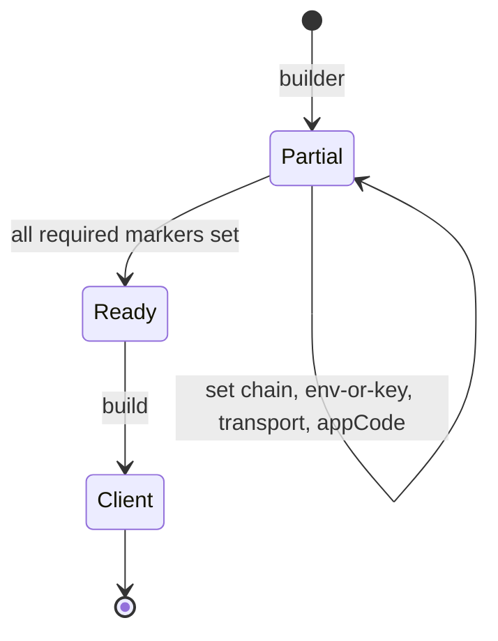

# Sole Construction Seam

**Invariant** — `OrderbookApi`, `SubgraphApi`, and `Trading` construct exclusively through their
typestate builders. The required inputs (chain, environment or API key, transport, appCode) are
compile-time markers, so a misconstructed client is a build error rather than a first-quote
runtime surprise. No inherent associated constructor remains on any of the three except
`builder()`; ergonomic shortcuts ship as builder-terminal methods that consume *total* typed
inputs and never `Partial*` shapes; marker types use private fields so external crates cannot
forge them.

**Why** — A runtime "you forgot the transport" panic on the first quote is a strictly worse
failure than a compile error; private markers stop a downstream crate assembling a half-built
client behind the SDK's back.

**How to comply**
- Construct via `Client::builder()…build()`; do not add inherent `new()` / `with_*()` constructors.
- Add ergonomic shortcuts as builder-terminal methods over total inputs.

**Shape**

**Enforced by** — `crates/trading/tests/ui/trading_sdk_no_free_constructors.rs` is a trybuild
compile-fail asserting `Trading::new(..)` does not compile; the orderbook setter-wall test guards
the `Partial*` rule.

**Anchored by**: [ADR 0013](../adr/0013-http-transport-injection-and-typestate-builders.md) (primary). Supporting: [ADR 0011](../adr/0011-typed-amount-boundary-and-typestate-ready-state-construction.md).
