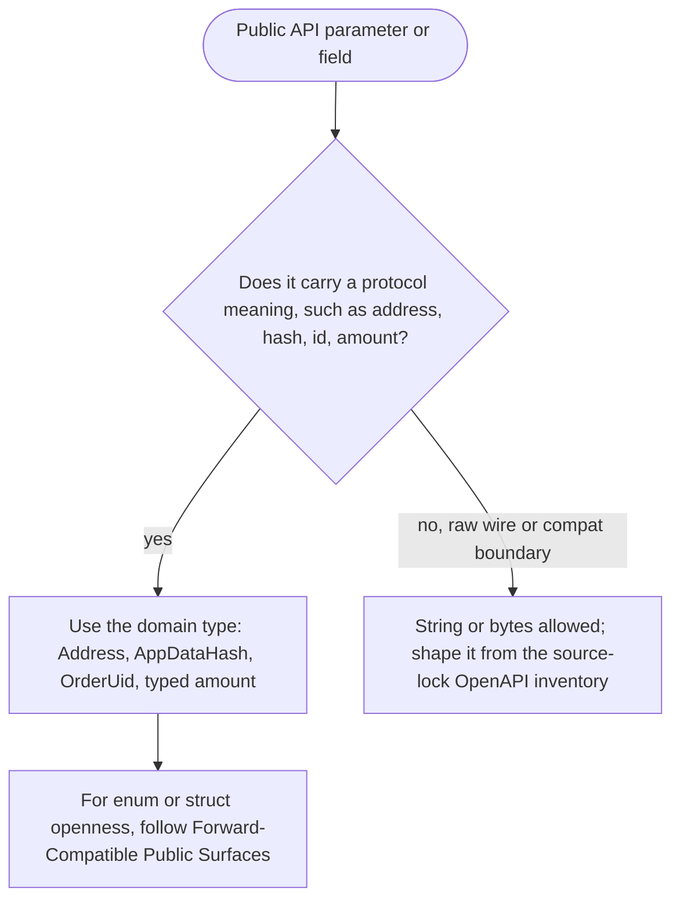

# Strong Typed Public Surfaces

**Invariant** — Public Rust APIs prefer domain types for protocol meanings such as addresses,
hashes, identifiers, and amounts. String-heavy representations are reserved for explicit wire
contracts and compatibility boundaries, whose field shapes derive from the source-lock-pinned
OpenAPI inventory rather than hand-written prior memory.

**Why** — Stringly-typed protocol values let a caller pass an address where a hash belongs and
push every validation to runtime, which is exactly where a trading SDK can least afford it.

**How to comply**
- Use the domain type (`Address`, `AppDataHash`, `OrderUid`, a typed amount) on public signatures;
  keep `String`/bytes for raw wire DTOs.
- For enum and struct *openness* postures (`#[non_exhaustive]`, unknown-field handling), follow
  [Forward-Compatible Public Surfaces](forward-compatible-public-surfaces.md) — that principle
  owns the full posture matrix; this one owns the type-vs-string choice.

**Decision**

**Enforced by** — `check-enum-policy` (every public enum classified in the manifest) and
`check-deny-unknown-fields` (allowlists where `serde(deny_unknown_fields)` is permitted).

**Anchored by**: [ADR 0011](../adr/0011-typed-amount-boundary-and-typestate-ready-state-construction.md) (primary). Supporting: [ADR 0005](../adr/0005-boundary-specific-runtime-contracts-and-strong-domain-types.md), [ADR 0015](../adr/0015-client-side-order-bounds-validator.md), [ADR 0016](../adr/0016-split-sell-and-buy-token-balance-enums.md), [ADR 0017](../adr/0017-typed-orderbook-rejection-parser.md), [ADR 0018](../adr/0018-typed-app-data-merge.md), [ADR 0021](../adr/0021-orderbook-total-fee-policy.md), [ADR 0052](../adr/0052-alloy-primitives-canonical-primitive-layer.md), [ADR 0053](../adr/0053-typed-signer-rejection-classification.md), [ADR 0059](../adr/0059-hash-concrete-orderdata-directly.md), [ADR 0060](../adr/0060-uniform-error-classification.md), [ADR 0061](../adr/0061-wasm-abi-receiver-pay-to-owner.md), [ADR 0064](../adr/0064-app-data-typed-validation.md), [ADR 0067](../adr/0067-idiomatic-accessor-naming.md).
