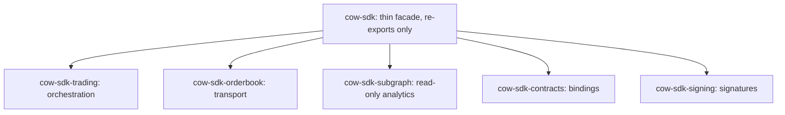

# Thin Facade, Real Crate Boundaries

**Invariant** — `cow-sdk` is the ergonomic entrypoint, not a second implementation layer. Leaf
crates own transport, orchestration, browser integration, and other specialized behavior; the
facade re-exports them.

**Why** — Logic that creeps into the facade duplicates a leaf crate, drifts from it over time,
and forces a consumer who wants one capability to compile the whole stack.

**How to comply**
- Add a capability in the leaf crate that owns its domain; expose it by re-export from `cow-sdk`.
- Keep the facade free of business logic — it wires crates together and re-exports their surface.

**Shape**

**Enforced by** — documentation-only (unenforced). The `public_api` tests prove the facade's
re-exports resolve, but no gate asserts the facade carries no logic; a facade-thinness check is
a candidate future hardening.

**Anchored by**: [ADR 0001](../adr/0001-multi-crate-sdk-family-with-thin-facade.md) (primary). Supporting: [ADR 0002](../adr/0002-dedicated-trading-orchestration-crate.md), [ADR 0003](../adr/0003-separate-read-only-subgraph-crate.md), [ADR 0062](../adr/0062-internal-shared-test-support-crate.md), [ADR 0063](../adr/0063-published-consumer-test-doubles-crate.md).
