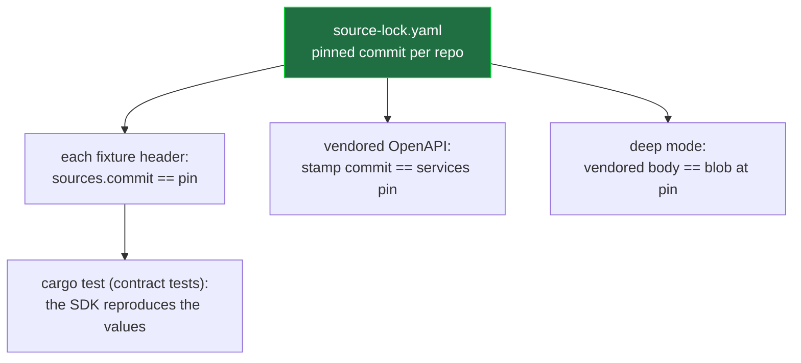
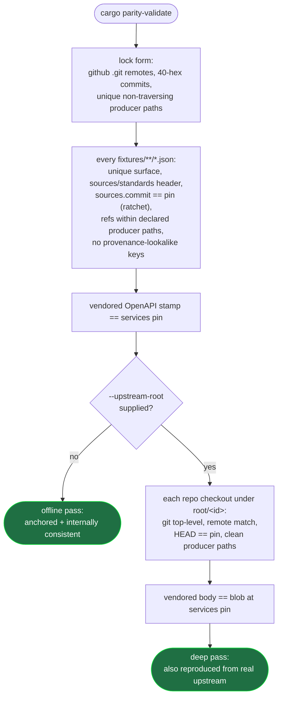
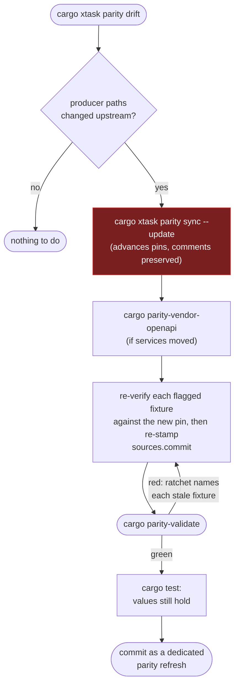

# Parity Maintenance Contract

`parity/` is a committed, reviewable evidence layer for the Rust SDK. It is
**not** a runtime dependency of any published crate — normal builds, tests, and
publishes never touch it.

Its job: let a reviewer trust that every committed test vector came from the
upstream code and version it claims — without cloning anything.

## What lives here

| Path | Role |
| --- | --- |
| `source-lock.yaml` | One pinned commit per upstream producer repository. The single committed source of truth. |
| `fixtures/**/*.json` | The committed test-vector corpus. Every file carries a provenance header and is validated per-file by `cargo parity-validate`. |
| `openapi/services-orderbook.yml` | The vendored services OpenAPI document, stamped with its source commit. |
| `openapi/coverage.yaml` | The DTO coverage manifest the wire-shape check reads. |

## The mental model

**Pins are the only committed truth; every hash is derived from them at check
time.** A pin (a 40-character commit) already content-addresses every file in
the upstream tree, so the system never commits a checksum it could instead
derive. The one exception is a hash over compiled bytes rather than a pinned
text file — the COW Shed creation-code `keccak256` entries, which lock the
embedded `.bin` blobs; those blobs are themselves byte-identical to the
`COW_SHED_PROXY_INIT_CODE` constants in the pinned cow-sdk commit, so even
this exception chains back to a pin.

Everything a reviewer relies on chains back to the pins:



`cargo parity-validate` proves the **provenance** half (every vector is pinned
and honestly attributed to a declared upstream source; the deep pass also
reproduces the pinned bytes from a real checkout). `cargo test` proves the
**value** half (our Rust reproduces those vectors byte-for-byte). Green on both =
the SDK matches upstream at a known, auditable commit.

## Everyday check

```sh
cargo parity-validate
```

Offline, needs no checkouts, runs on every PR. It turns a fixture's source
attribution from a claim into a machine-checked fact: the cited commit is the
one pinned in the lock, and every ref lands in that repository's declared
producer paths, so no fixture can drift its pin or cite an undeclared source. It
does **not** re-derive the bytes from upstream — that is the deep pass below and
`cargo test`.

## What validation checks



- **Offline** (every PR): the lock is well-formed, every fixture is honestly
  attributed to a pin, and the vendored spec is stamped at the services pin.
- **Deep** (`workflow_dispatch` and the weekly cron, never the PR lane):
  additionally every pinned repository is present at its commit and the vendored
  OpenAPI body is byte-identical to the upstream blob at the pin. No committed
  checksum is involved; both sides derive from the pin.

## Maintainer workflow: refreshing the pins

All commands share one upstream-root convention:
`--root` / `--upstream-root` > `XTASK_UPSTREAM_ROOT` > `target/upstream`, with
one checkout per lock repository at `<root>/<id>`. A long-lived personal root
plugs in with a single profile line (`$env:XTASK_UPSTREAM_ROOT = "<your root>"`).

Updating a pin is a deliberate, reviewed act. The loop:



Step by step:

```sh
# 1. Materialize (or re-detach) the pinned checkouts as blob-less clones.
cargo xtask parity sync

# 2. Read-only drift report: which producer paths (and watched directories)
#    moved on the upstream default branches. Exit 0 = clean, 1 = drift, 2 = a
#    pin/fetch failed. A pin marked `hold:` is reported for visibility but does
#    not count as actionable drift. The upstream-drift workflow runs this weekly.
cargo xtask parity drift

# 3. Advance the pins: fetch each default branch, print the per-file drift
#    table (git blob OIDs), rewrite the commit: lines, fail closed if a
#    producer path vanished at the new pin. A pin marked `hold:` is left at its
#    pinned commit and never advanced here.
cargo xtask parity sync --update

# 4. Re-vendor the OpenAPI if services moved (zero-argument: it pins the
#    services checkout itself, then writes the stamped document).
cargo parity-vendor-openapi

# 5. Validate. It fails closed until the refresh is complete: the ratchet
#    names every fixture still stamped at the old commit, and the stamp gate
#    names the re-vendor step. That failure list IS the to-do list.
cargo parity-validate

# 6. Prove the values still hold against the new upstream.
cargo test
```

After `--update`, `cargo parity-validate` is *expected* to fail until every
flagged fixture is re-verified and re-stamped — that fail-closed behavior is
the point, not a bug.

Deep-validate every pinned repository plus the vendored OpenAPI body against
the blob at the services pin — the deep CI lane runs exactly this:

```sh
cargo xtask parity sync --root <dir>
cargo parity-validate --upstream-root <dir>
```

## Fixture header grammar

Every fixture starts with a provenance header; payload keys (`cases`, `rows`,
`examples`, `payload`, …) follow and stay test-owned:

```json
{
  "surface": "orderbook-trade",
  "dto": "cow_sdk_orderbook::Trade",
  "endpoint": "GET /api/v1/trades",
  "sources": {
    "services": {
      "commit": "<the lock pin for services>",
      "refs": ["crates/orderbook/openapi.yml#components.schemas.Trade"]
    }
  },
  "standards": ["RFC 7231 §7.1.1.1"],
  "derivation": "one sentence when our own code produced the golden bytes"
}
```

- `surface` (required) — unique across the corpus. Provenance-lookalike keys
  (`source`, `source_refs`, `@source_ref`) are rejected — unknown keys are
  payload by design, so a provenance-shaped key the grammar does not know would
  otherwise sit unvalidated while looking validated.
- `sources` — one entry per cited lock repository. The `commit` must equal that
  repository's pin (the freshness ratchet: bumping a pin fails every citing
  fixture by name until it is consciously re-verified and re-stamped). Each ref
  is `path#fragment`; the path must appear in the lock row's `producer_paths`,
  the fragment is human-facing (symbol names or OpenAPI schema paths preferred;
  `#L<start>-L<end>` line ranges are legal but rot).
- `standards` — non-repo authorities (RFCs, EIPs) as free-text strings.
- `derivation` — optional, for golden vectors our own implementation produced
  against a spec.
- Every fixture must declare `sources` and/or `standards`.
- Case-level refs use `"source_ref": "repo:path#fragment"` — no commit segment
  (commits live once per repo in `sources`), and only paths the file-level
  `sources` declare.
- Raw wire documents are wrapped under a `"payload"` key so the header never
  collides with the wire shape the consuming test round-trips.
- `dto` / `endpoint` are optional free-text conveniences mapping the fixture to
  the Rust type and HTTP surface.

Fixtures hold **class-T** content only: values transcribed from a pinned
upstream artifact (digests, byte vectors, wire-DTO samples, RFC-derived dates).
Self-derived **class-C** convention pins — outputs our own formula produces from
inputs, with no upstream byte to transcribe — live inline in the consuming test
as `const` literals with a derivation comment, not as a fixture. The one
exception is a self-derived pin that anchors a *cross-cutting* contract — an
ADR's reference-vector set that also seeds a fuzz corpus and is asserted by more
than one suite — where a single header-validated fixture is the more auditable
home than the same vectors copied inline across every consumer. The ECDSA
`v`-normalization vectors (`fixtures/ecdsa/v_normalization.json`, governed by
ADR 0022 and seeding `fuzz_recover_ecdsa_address`) are the only such pin.

## One home per provenance class

Anything whose **values** come from upstream or pin a cross-crate contract is a
fixture here, under a validated header. Crate-local `tests/fixtures/`
directories may hold only mock scaffolding whose bytes are incidental and
self-owned (currently: none). Compiled crate assets (for example the COW Shed
proxy creation-code `.bin` files) live in `src/` and are hash-locked by a
fixture here instead of moving.

The app-data metadata is validated by typed Rust construction, not a vendored
JSON-Schema bundle. `fixtures/app_data/schemas/` retains one self-contained
mirror per modeled metadata family plus the root-document manifest mirror
(`app-data-document-v*.json`). The `schema_drift_contract` tests assert the typed
structs still match the producer field names, that each modeled numeric bound
matches the mirror's declared `maximum`, and that `LATEST_APP_DATA_VERSION` and
the modeled families' versions track the manifest — so a rename, a constraint
change, or a version bump fails at review time. Because schemas are versioned
additively (a new version is a new file), the `cow-sdk` lock row also lists
`watch_dirs` over the schema tree, so `cargo xtask parity drift` reports a newly
added schema file the exact producer-path diff cannot see. Refresh the mirrors
from the `cow-sdk` pin (its `packages/app-data/src/schemas` tree) when the drift
report or a drift test flags a change.

## Command reference

| Goal | Command |
| --- | --- |
| Everyday gate (offline) | `cargo parity-validate` |
| Materialize the upstreams locally | `cargo xtask parity sync` |
| Strict gate (deep) | `cargo parity-validate --upstream-root <dir>` |
| Did upstream move? | `cargo xtask parity drift` |
| Advance the pins | `cargo xtask parity sync --update` |
| Re-vendor the OpenAPI | `cargo parity-vendor-openapi` |
| DTO wire-shape coverage | `cargo parity-openapi-coverage` |
| Live deployment probe | `cargo registry-confirm -- --mode local --chain-ids <ids>` |

## Boundaries

This is a structural parity contract, not a runtime cross-language harness. No
TypeScript executes during `cargo test`; behavioral cross-verification would
require a separate harness beyond this layer.

`cargo parity-validate` checks **provenance**, not payload values: it holds every
fixture to its pinned source and confirms each ref lands in a declared producer
path, but the payload below the header is opaque to it. Whether a payload value is
a legal instance of the cited schema — an enum member, a value in range — is
proven by the consuming `cargo test`. For a wire field the SDK models as a typed
enum, an illegal value fails deserialization there; for a field the SDK keeps as an
opaque string for forward compatibility, a dedicated contract test pins the closed
set of legal values against its upstream producer.

External reference implementations are not part of this contract. They may be
consulted as a secondary reference, but never as a provenance source for
committed fixtures, placeholder values, or copied defaults.

See [docs/parity.md](../docs/parity.md) for the full authority and ownership
split, and the
[Source-Lock Provenance Audit](../docs/audit/source-lock-provenance-audit.md)
for the standing review record.
